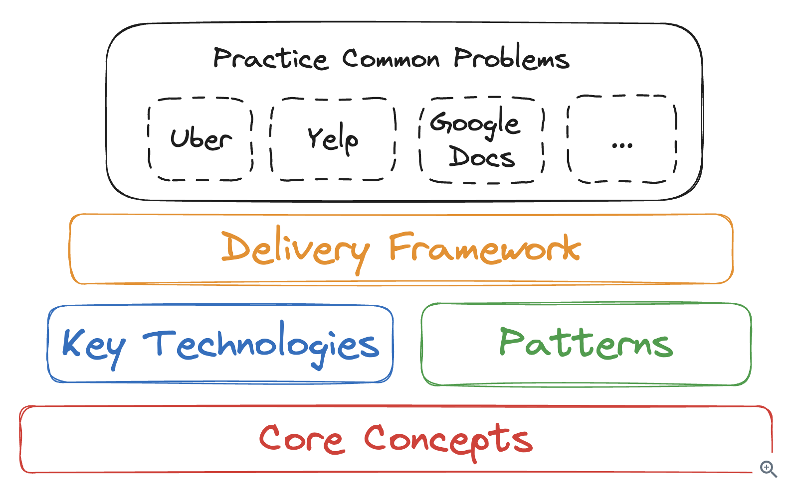
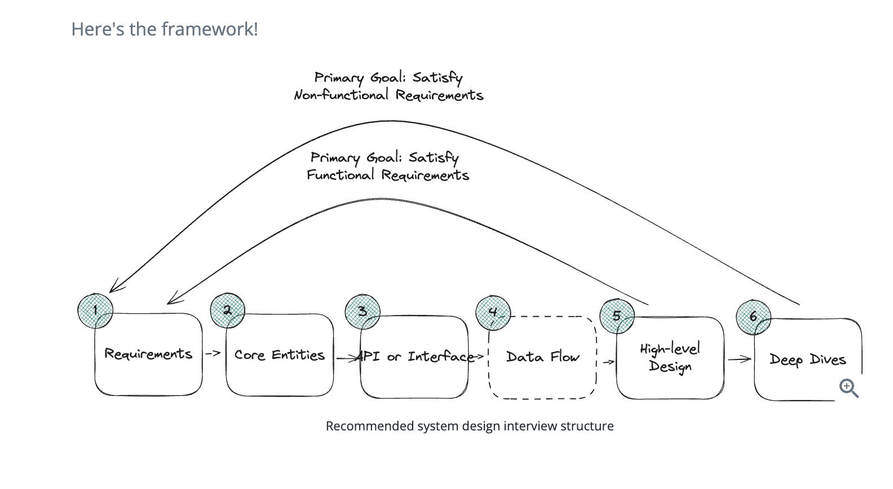

# Overall Structure
Here is overall structure:


# Delivery Framework
Delivery framework is a sequence of steps and timings.


## Requirements (~5 minutes)
The goal of the requirements section is to get a clear understanding of the system that you are being asked to design. To do this, we suggest you break your requirements into two sections.

### 1) Functional Requirements
Functional requirements are your "Users/Clients should be able to..." statements. These are the core features of your system and should be the first thing you discuss with your interviewer. 

For example, if you were designing a system like Twitter, you might have the following functional requirements:
- Users should be able to post tweets
- Users should be able to follow other users
- Users should be able to see tweets from users they follow

### 2) Non-functional Requirements
Non-functional requirements are statements about the system qualities that are important to your users. These can be phrased as "The system should be able to..." or "The system should be..." statements.

For example, if you were designing a system like Twitter, you might have the following non-functional requirements:
- The system should be highly availability, prioritizing availability over consistency
- The system should be able to scale to support 100M+ DAUs (Daily Active Users)
- The system should be low latency, rendering feeds in under 200ms

Here is a checklist of things to consider that might help you identify the most important non-functional requirements for your system. You'll want to identify the top 3-5 that are most relevant to your system.
- CAP Theorem: Should your system prioritize consistency or availability? Note, partition tolerance is a given in distributed systems.
- Environment Constraints: Are there any constraints on the environment in which your system will run? For example, are you running on a mobile device with limited battery life? Running on devices with limited memory or limited bandwidth (e.g. streaming video on 3G)?
- Scalability: All systems need to scale, but does this system have unique scaling requirements? For example, does it have bursty traffic at a specific time of day? Are there events, like holidays, that will cause a significant increase in traffic? Also consider the read vs write ratio here. Does your system need to scale reads or writes more?
- Latency: How quickly does the system need to respond to user requests? Specifically consider any requests that require meaningful computation. For example, low latency search when designing Yelp.
- Durability: How important is it that the data in your system is not lost? For example, a social network might be able to tolerate some data loss, but a banking system cannot.
- Security: How secure does the system need to be? Consider data protection, access control, and compliance with regulations.
- Fault Tolerance: How well does the system need to handle failures? Consider redundancy, failover, and recovery mechanisms.
- Compliance: Are there legal or regulatory requirements the system needs to meet? Consider industry standards, data protection laws, and other regulations.

### 3) Capacity Estimation
Avoid as it is often unnecessary and bog down with math details.


## Core Entities (~2 minutes)
- Who are Actors?
- Resources needed for functional requirements

List the core entities of your system. This helps you to define terms, understand the data central to your design, and gives you a foundation to build on. These are the core entities that your API will exchange and that your system will persist in a Data Model. In the actual interview, this is as simple as jotting down a bulleted list and explaining this is your first draft to the interviewer.

For our Twitter example, our core entities are rather simple:
- User
- Tweet
- Follow

Start with a small list and dig deeper into details later as part of HLD.


## API or System Interface (~5 minutes)
Before you get into the high-level design, you'll want to define the contract between your system and its users. This maps directly to the functional requirements you've already identified (but not always!). You will use this contract to guide your high-level design and to ensure that you're meeting the requirements you've identified.

You have a quick decision to make here -- do you want to design a RESTful API or a GraphQL API?
RESTful API: The standard communication constraints of the internet. Uses HTTP verbs (GET, POST, PUT, DELETE) to perform CRUD operations on resources.

GraphQL API: A newer communication protocol that allows clients to specify exactly what data they want to receive from the server.

Wire Protocol: If you're communicating over websockets or raw TCP sockets, you'll want to define the wire protocol. This is the format of the data that will be sent over the network, usually in the format of messages.

Don't overthink this. Bias toward creating a REST API. Use GraphQL only if you really need clients to fetch only the requested data (no over- or under- fetching). If you're going to use websockets, you'll want to describe the wire protocol.

For Twitter, we would choose REST and would have the following endpoints. Notice how we can use our core entities as the objects that are exchanged via the API.

```html
POST /v1/tweet
body: {
  "text": string
}

GET /v1/tweet/:tweetId -> Tweet

POST /v1/follow/:userId

GET /v1/feed -> Tweet[]
```

## [Optional] Data Flow (~5 minutes)
For some backend systems, especially data-processing systems, it can be helpful to describe the high level sequence of actions or processes that the system performs on the inputs to produce the desired outputs. If your system doesn't involve a long sequence of actions, skip this!
We usually define the data flow via a simple list. You'll use this flow to inform your high-level design in the next section.

For a web crawler, this might look like:
- Fetch seed URLs
- Parse HTML
- Extract URLs
- Store data
- Repeat

## High Level Design (~10-15 minutes)
Now that you have a clear understanding of the requirements, entities, and API of your system, you can start to design the high-level architecture. This consists of drawing boxes and arrows to represent the different components of your system and how they interact. Components are basic building blocks like servers, databases, caches, etc. 

As you're drawing your design, you should be talking through your thought process with your interviewer. Be explicit about how data flows through the system and what state (either in databases, caches, message queues, etc.) changes with each request, starting from API requests and ending with the response. 

When your request reaches your database or persistence layer, it's a great time to start documenting the relevant columns/fields for each entity. You can do this directly next to your database visually. This helps keep it close to the relevant components and makes it easy to evolve as you iterate on your design. 

## Deep Dives (~10 minutes)
Now that you have a high-level design in place you're going to use the remaining 10 or so minutes of the interview to harden your design by (a) ensuring it meets all of your non-functional requirements (b) addressing edge cases (c) identifying and addressing issues and bottlenecks and (d) improving the design based on probes from your interviewer.


# Core Concepts

Below are the most common concepts you'll encounter in a system design interview.

## Scaling
- Horizontal: Add more machines and use load balancer
- Vertical: Add more resources to server (More RAM, DIsk, CPUs)

Scale vertical first as it is easier to accomplish without adding complexities.

Once Vertical is exhaused switch to Horizontal.

When horizontal scaling is the right solution, you'll need to consider how to distribute work across your machines. Most modern systems use a technique called "Consistent Hashing" to distribute work across a set of machines - this is a technique that arranges both data and machines in a circular space called a "hash ring", allowing you to add or remove machines with minimal data redistribution.

## Work Distribution
Needed for Horizontal Scaling, done via Laod Balancers. Round Robin or Queue system?

Work distribution needs to try to keep load on the system as even as possible. 

## Data Distribution
You'll also need to consider how to distribute data across the system.

Inherently, horizontal scaling on data introduces synchronization challenges. You're either reading and writing data to a shared database which is a network hop away (≈ 1-10ms, ideally) or you're keeping multiple redundant copies across each of your servers. This means race conditions and consistency challenges! Most database systems are built to resolve some of the these problems directly (e.g. by using transactions). In other cases, you may need to use a Distributed Lock. Regardless, you'll need to be prepared to discuss how you're going to keep your data Consistent.

## CAP Theorem
The CAP theorem is a fundamental concept in distributed systems that states you can only have two of three properties: Consistency, Availability, and Partition tolerance. In practice, since network partitions are unavoidable, this means choosing between consistency and availability.

Choosing consistency means that all nodes in your system will see the same data at the same time. When a write occurs, all subsequent reads will return that value, regardless of which node they hit. However, during a network partition, some nodes may become unavailable to maintain this consistency guarantee.

On the other hand, opting for availability means that every request will receive a response, even during network partitions. The tradeoff is that different nodes may temporarily have different versions of the data, leading to inconsistency. The system will eventually reconcile these differences, but there's no guarantee about when this will happen.

In a system design interview, availablity should be your default choice. You only need strong consistency in systems where reading stale data is unacceptable.
Examples of systems that require strong consistency include:
- Inventory management systems, where stock levels need to be precisely tracked to avoid overselling products
- Booking systems for limited resources (airline seats, event tickets, hotel rooms) where you need to prevent double-booking
- Banking systems where the balance of an account must be consistent across all nodes to prevent fraud


## Locking
Locking is the process of ensuring that only one client can access a shared resource at a time.

Locks are important for enforcing the correctness of our system but can be disastrous for performance.

There's three things to worry about when employing locks:
### Granularity of the lock
We want locks to be as fine-grained as possible. This means that we want to lock as little as possible to ensure that we're not blocking other clients from accessing the system. For example, if we're updating a user's profile, we want to lock only that user's profile and not the entire user table.

### Duration of the lock
We want locks to be held for as short a time as possible. 

### Whether we can bypass the lock
In many cases, we can avoid locking by employing an "optimistic" concurrency control strategy, especially if the work to be done is either read-only or can be retried. In an optimistic strategy we're going to assume that we can do the work without locking and then check to see if we were right. In most systems, we can use a "compare and swap" operation to do this.

## Indexing
Indexing is about making data faster to query. In many systems, we can tolerate slow writes but we can't tolerate slow reads. Indexing is the process of creating a data structure that makes reads faster.
- Keep data in a HashMap by key => O(1) access
- Keep in sorted list so binary search can be used => O(log n); Most common

### Indexing in Databases
Most questions of indexing will happen inside your database. Depending on your database choice, you'll have different options for indexing. For example, most relational databases allow you to create indexes on any column or group of columns in a table. This isn't unbounded, however. While databases like DynamoDB allow you to create many secondary indexes, for databases like Redis you're on your own to design and implement your own indexing strategy.

If you can do your indexing in your primary database, do it! Databases have been battle-honed over decades for exactly this problem, so don't reinvent the wheel unless you have to.

### Specialized Indexes
In addition to the basic indexing strategies, there are many specialized indexes that are used to solve specific problems. For example, geospatial indexes are used to index location data. This is useful for systems that need to do things like find the nearest restaurant or the nearest gas station. Vector databases are used to index high-dimensional data. This is useful for systems that need to do things like find similar images or similar documents. And full-text indexes are used to index text data. This is useful for systems that need to do things like search for documents or search for tweets.

ElasticSearch is our recommended solution for these secondary indexes, when it can work. ElasticSearch supports full-text indexes (search by text) via Lucene, geospatial indexes, and even vector indexes. You can set up ElasticSearch to index most databases via Change Data Capture (CDC) where the ES cluster is listening to changes coming from the database and updating its indexes accordingly. This isn't a perfect solution! By using CDC, you're introducing a new point of failure and a new source of latency, the data read out of your search index is going to be stale, but that may be ok.

## Communication Protocols
You've got two different categories of protocols to handle: internal and external. Internally, for a typical microservice application which consistitues 90%+ of system design problems, either HTTP(S) or gRPC will do the job. Don't make things complicated.

Externally, you'll need to consider how your clients will communicate with your system: who initiates the communication, what are the latency considerations, and how much data needs to be sent.

Across choices, most systems can be built with a combination of HTTP(S), SSE (Server Side Events) or long polling, and Websockets.

HTTPS => used for APIs, stateless so easy to scale

Long Polling (HTTP based) => the client makes a request to the server and the server holds the request open until it has new data to send to the client. Once the data is sent, the client makes another request and the process repeats. Notably, you can use standard load balancers and firewalls with long polling - no special infrastructure needed.

Websockets => necessary if you need realtime, bidirectional communication between the client and the server. 

Server Sent Events (SSE) => a great way to send updates from the server to the client. They're similar to long polling, but they're more efficient for unidirectional communication from the server to the client. SSE allows the server to push updates to the client whenever new data is available, without the client having to make repeated requests as in long polling. This is achieved through a single, long-lived HTTP connection, making it more suitable for scenarios where the server frequently updates data that needs to be sent to the client. Unlike Websockets, SSE is designed specifically for server-to-client communication and does not support client-to-server messaging. This makes SSE simpler to implement and integrate into existing HTTP infrastructure, such as load balancers and firewalls, without the need for special handling.

Note: Statefulness is a major source of complexity for systems. Where possible, relegating your state to a message broker or a database is a great way to simplify your system. This enables your services to be stateless and horizontally scalable while still maintaining stateful communication with your clients.

## Security
Security should be top of mind

### Authentication / Authorization
Delegating this work to either an API Gateway or a dedicated service like Auth0 is a great way to ensure that you're not reinventing the wheel.

### Encryption
HTTPS is the SSL/TLS protocol that encrypts data in transit and is the standard for web traffic. If you're using gRPC it supports SSL/TLS out of the box. For data at rest, you'll want to use a database that supports encryption or encrypt the data yourself before storing it.

### Data Protection
Data protection is the process of ensuring that data is protected from unauthorized access, use, or disclosure.


## Monitoring
Once you've designed your system, some interviewers will ask you to discuss how you'll monitor it. The idea here is simple: candidates who understand monitoring are more likely to have experience with actual systems in production. Monitoring real systems is also a great way to learn about how systems actually scale (and break).
Monitoring generally occurs at 3 levels, and it's useful to name them.
### Infrastructure Monitoring
Infrastructure monitoring is the process of monitoring the health and performance of your infrastructure. This includes things like CPU usage, memory usage, disk usage, and network usage.

This is often done with a tool like Datadog or New Relic. 

### Service-Level Monitoring
Service-level monitoring is the process of monitoring the health and performance of your services. 

### Application-Level Monitoring
Application-level monitoring is the process of monitoring the health and performance of your application. This includes things like the number of users, the number of active sessions, and the number of active connections. This could also include key business metrics for the business. This is often done with a tool like Google Analytics or Mixpanel. This is often the most important level of monitoring for product design interviews.

