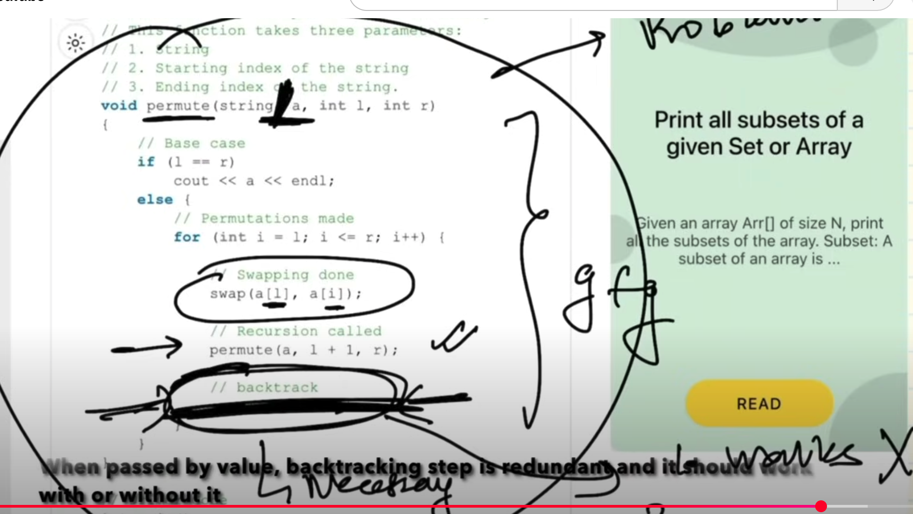
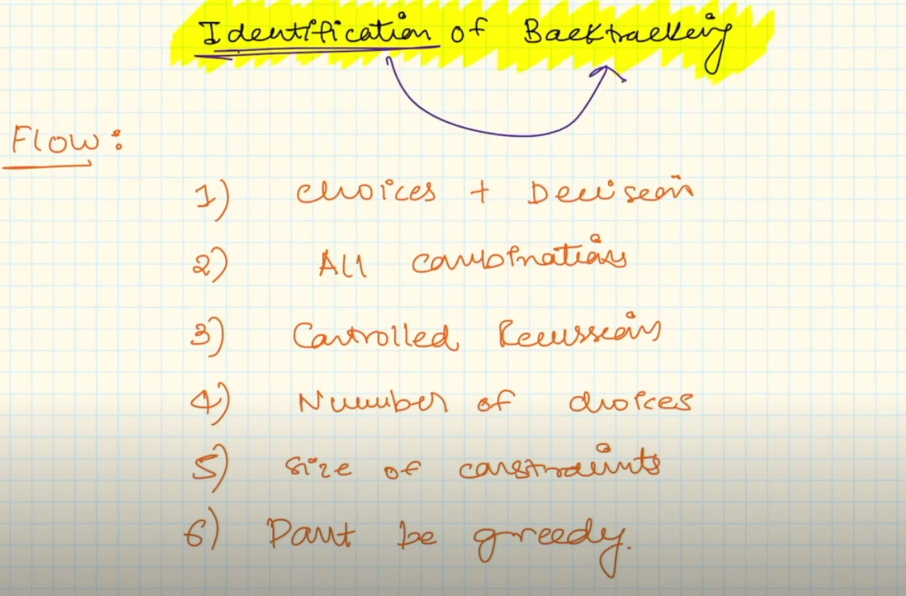
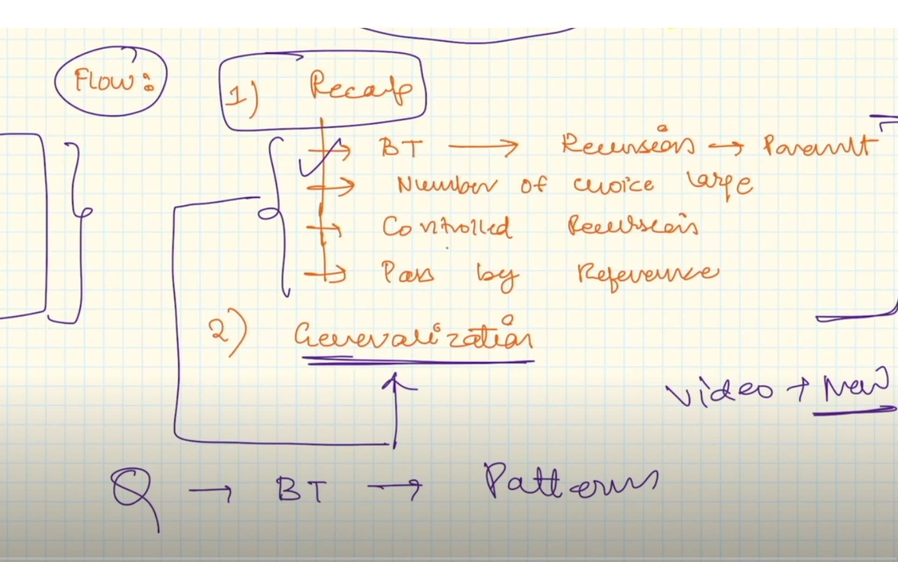
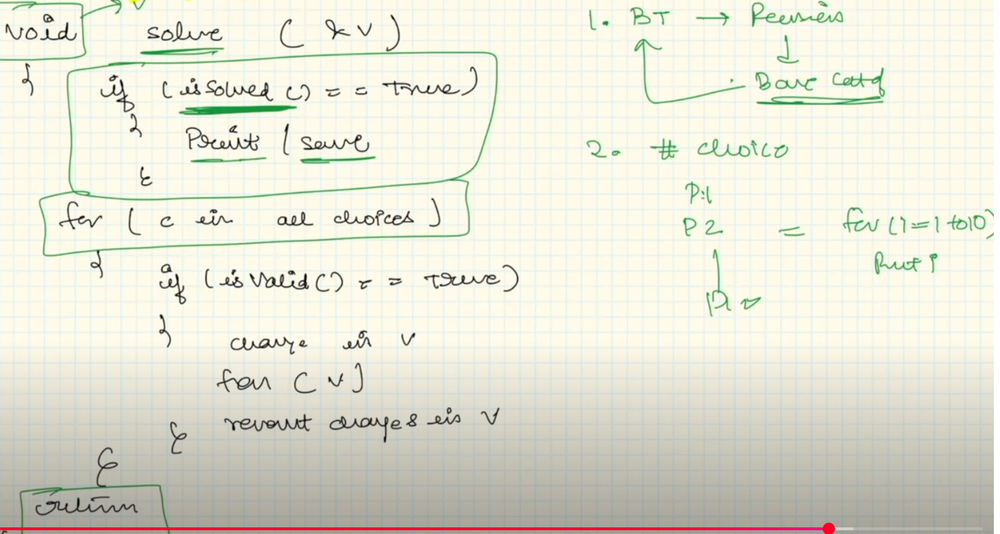
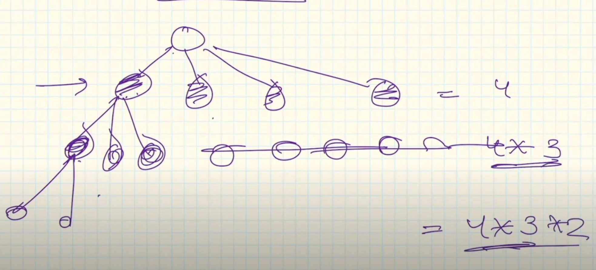
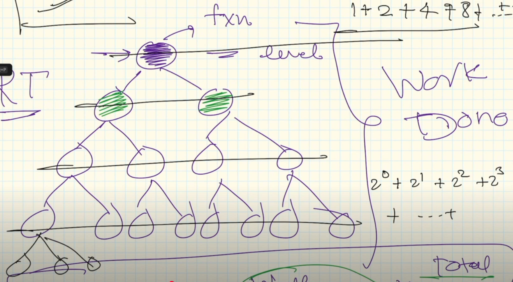
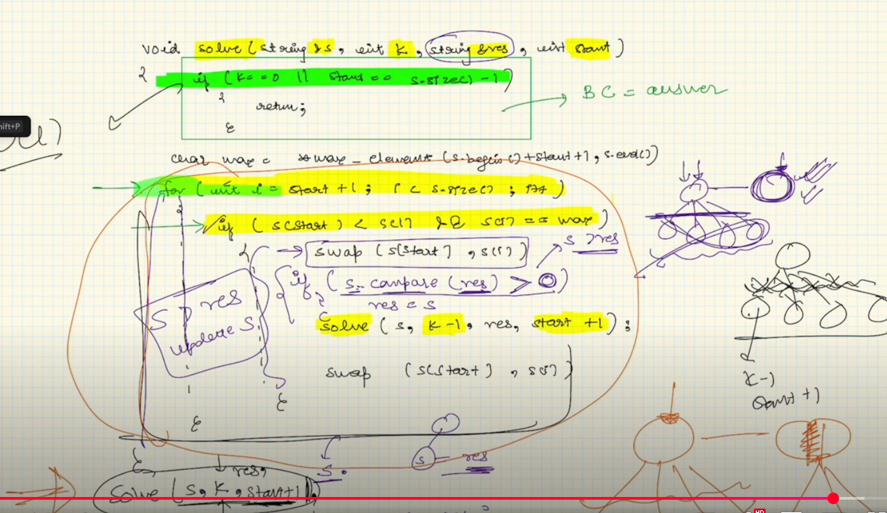

## Backtracking:
Key point: Undo the change which you did before calling the recursion 

1.


2.


3.


4.


5.


Problem: 
https://www.geeksforgeeks.org/problems/permutations-of-a-given-string2041/1<br>
Given a string s, which may contain duplicate characters, your task is to generate and return an array of all unique permutations of the string. You can return your answer in any order.

The below solution uses Recurion not BT.
```c++
#include<vector>
#include<string>
#include<unordered_set>
#include <iostream>

using namespace std;

void permute(string ip, string op, vector<string> &v)
{
    if (ip.size() == 0) //<== controlled recursion
    {
        v.push_back(op);
        return;
    }

    unordered_set<char> mp;
    for (int i = 0; i < ip.size(); i++) //<== for Choices loop
    {
        if (mp.find(ip[i]) == mp.end()) //<== controlled condition
        {
            mp.insert(ip[i]);
            string newip = ip.substr(0, i) + ip.substr(i + 1);

            string newop = op + ip[i];
            cout << i << ", ip: " << ip << ", newip: " << newip << ", newop: " << newop << endl;
            permute(newip, newop, v); //<== passing by value so not a BackTracking solution; if we pass ip as reference and not use op, it will turn into a BT solution
        }
    }
}

vector<string> find_permutation(string S)
{
    // Code here there
    vector<string> v;
    permute(S, "", v);
    return v;
}

int main() {
    // Write C++ code here
    std::cout << "Welcome" << endl;
    auto v = find_permutation("abc");
    for(auto s: v)
        cout << s << endl;
    return 0;
}
```

### Time complexity of Recursive Tree in above code

Time complxity = Time complexity of one node X number of nodes in the tree

Above tree will have nodes like this which comes out to be n!


A balance tree will be 2 pow n.


### Using BackTracking for above problme

simple solution:
```c++
#include <iostream>
#include <vector>
#include <string>
#include <set>
#include <algorithm>

class Solution {
private:
    void backtrack(std::string& s, int start, std::set<std::string>& result) {
        if (start == s.length() - 1) {
            result.insert(s);
            return;
        }
        
        for (int i = start; i < s.length(); ++i) {
            // Swap characters to generate permutation
            std::swap(s[start], s[i]);
            backtrack(s, start + 1, result);
            // Undo the swap to backtrack
            std::swap(s[start], s[i]);
        }
    }

public:
    std::vector<std::string> permutation(std::string s) {
        std::set<std::string> uniquePermutations;
        backtrack(s, 0, uniquePermutations);
        
        // Convert set to vector because the return type is vector<string>
        return std::vector<std::string>(uniquePermutations.begin(), uniquePermutations.end());
    }
};

int main() {
    Solution solution;
    std::string s = "aba";
    std::vector<std::string> permutations = solution.permutation(s);
    
    for (const auto& perm : permutations) {
        std::cout << perm << std::endl;
    }
    
    return 0;
}
```


```c++
class Solution
{
public:
	vector<string>find_permutation(string S)
	{
	    // Code here there
	    set<string> ans;
	    permutations(S,0,ans);
	    vector<string> vc(ans.begin(), ans.end());
	    
	    return vc;
	}
	void permutations(string &s, int start, set<string> &ans){
	    if(start == s.size()-1){
		ans.insert(s);
		return;
	    }
	    
	    unordered_map<char,int> mp;
	    for(int i = start; i < s.size(); i++){
		if(mp.find(s[i]) == mp.end()){
		    mp[s[i]]++;
		    
		    if(s[i] != s[start]){
			swap(s[i],s[start]);
			permutations(s,start+1,ans);
		    	// backtracking step
		    	swap(s[i],s[start]);
		    }
		    else
		       permutations(s,start+1,ans);
		}
	    }
	}
};
```

solution by Grok:
```c++
#include <string>
#include <vector>
#include <set>
#include <algorithm>

class Solution {
public:
    vector<string>find_permutation(string S) {
        set<string> ans;
        permutations(S, 0, ans);
        return vector<string>(ans.begin(), ans.end());
    }

private:
    void permutations(string &s, int start, set<string> &ans) {
        if(start == s.size() - 1) {
            ans.insert(s);
            return;
        }
        
        vector<bool> used(256, false);  // Assuming ASCII
        for(int i = start; i < s.size(); i++) {
            if(!used[s[i]]) {
                used[s[i]] = true;
                swap(s[start], s[i]);
                permutations(s, start + 1, ans);
                swap(s[start], s[i]); // backtrack
            }
        }
    }
};

// Main or test function if needed
int main() {
    Solution sol;
    string S = "abc";
    vector<string> result = sol.find_permutation(S);
    for(const auto& perm : result) {
        cout << perm << " ";
    }
    cout << endl;
    return 0;
}
```

### Problem:
Given a number K and string str of digits denoting a positive integer, build the largest number possible by performing swap operations on the digits of str at most K times.


Approach:

Backtracking with swapping:

- Swap any two digits and recursively check if it leads to a larger number.
- Keep track of the maximum number found.
- Decrement K on each swap and backtrack after exploring.

Optimizations:

- If K == 0, stop further recursion.
- Swap only when it results in a larger number to reduce redundant computations.
- Store visited states to avoid unnecessary recomputation.

```c++
#include <iostream>
#include <string>
#include <algorithm>

using namespace std;

void findMaxNumber(string &str, int k, string &maxNum, int index) {
    if (k == 0) return; // No more swaps left

    int n = str.size();
    char maxDigit = str[index];

    // Find the maximum digit from the remaining string
    for (int i = index + 1; i < n; i++) {
        if (str[i] > maxDigit) {
            maxDigit = str[i];
        }
    }

    // If the current digit is already the largest, no need to swap
    if (maxDigit != str[index]) k--;

    // Explore all swaps with maxDigit found
    for (int i = index + 1; i < n; i++) {
        if (str[i] == maxDigit) {
            swap(str[index], str[i]); // Swap

            // Update maxNum if we found a larger number
            if (str > maxNum) {
                maxNum = str;
            }

            findMaxNumber(str, k, maxNum, index + 1);

            swap(str[index], str[i]); // Backtrack
        }
    }

    // Move to the next index without swapping
    findMaxNumber(str, k, maxNum, index + 1);
}

string largestNumber(string str, int k) {
    string maxNum = str;
    findMaxNumber(str, k, maxNum, 0);
    return maxNum;
}

int main() {
    string str = "129814999";
    int k = 4;
    
    cout << "Largest possible number: " << largestNumber(str, k) << endl;
    
    return 0;
}
```

### Problem: https://www.geeksforgeeks.org/problems/n-digit-numbers-with-digits-in-increasing-order5903/1
N Digit numbers with digits in increasing order


```c++
#include <iostream>
#include <vector>

using namespace std;

class Solution {
private:
    void backtrack(vector<int>& current, int n, int last_digit, vector<int>& result) {
        if (current.size() == n) {
            int num = 0;
            for (int digit : current) {
                num = num * 10 + digit;
            }
            result.push_back(num);
            return;
        }
        
        // Try all possible digits from last_digit + 1 to 9
        for (int i = last_digit + 1; i <= 9; ++i) {
            current.push_back(i); //Choose
            backtrack(current, n, i, result); //Explore
            current.pop_back(); // Backtrack
        }
    }

public:
    vector<int> increasingNumbers(int n) {
        vector<int> result;
        vector<int> current;
        
        // Start with 0 as last_digit so we start from 1 for the first digit
        backtrack(current, n, 0, result);
        
        return result;
    }
};

// Example usage
int main() {
    Solution sol;
    int n = 2; // Example with 2 digits
    vector<int> numbers = sol.increasingNumbers(n);
    for (int num : numbers) {
        cout << num << " ";
    }
    cout << endl;
    return 0;
}
```

### Rat in Maze - https://www.geeksforgeeks.org/problems/rat-in-a-maze-problem/1
Consider a rat placed at position (0, 0) in an n x n square matrix mat. The rat's goal is to reach the destination at position (n-1, n-1). The rat can move in four possible directions: 'U'(up), 'D'(down), 'L' (left), 'R' (right).

The matrix contains only two possible values:

- 0: A blocked cell through which the rat cannot travel.
- 1: A free cell that the rat can pass through.

Rat in a Maze using Backtracking:

We use a backtracking algorithm to explore all possible paths. While exploring the paths we keep track of the directions we have moved so far and when we reach to the bottom right cell, we record the path in a vector of strings. 


Step-by-step approach:

- Create isValid() function to check if a cell at position (row, col) is inside the maze and unblocked.
- Create findPath() to get all valid paths:
	- Base case: If the current position is the bottom-right cell, add the current path to the result and return.
	- Mark the current cell as blocked.
	- Iterate through all possible directions.
		- Calculate the next position based on the current direction.
		- If the next position is valid (i.e, if isValid() return true), append the direction to the current path and recursively call the findPath() function for the next cell.
		- Backtrack by removing the last direction from the current path.
- Mark the current cell as unblocked before returning.
  
Below is the implementation of the above approach:
```c++
#include <bits/stdc++.h>
using namespace std;

// Initialize a string direction which represents all the
// directions.
string direction = "DLRU";

// Arrays to represent change in rows and columns
int dr[4] = { 1, 0, 0, -1 };
int dc[4] = { 0, -1, 1, 0 };

// Function to check if cell(row, col) is inside the maze
// and unblocked
bool isValid(int row, int col, int n, vector<vector<int> >& maze)
{
    return row >= 0 && col >= 0 && row < n && col < n
           && maze[row][col];
}

// Function to get all valid paths
void findPath(int row, int col, vector<vector<int> >& maze,
              int n, vector<string>& ans,
              string& currentPath)
{
    // If we reach the bottom right cell of the matrix, add
    // the current path to ans and return
    if (row == n - 1 && col == n - 1) {
        ans.push_back(currentPath);
        return;
    }
    // Mark the current cell as blocked
    maze[row][col] = 0;

    for (int i = 0; i < 4; i++) {
        // Find the next row based on the current row (row)
        // and the dr[] array
        int nextrow = row + dr[i];
        // Find the next column based on the current column
        // (col) and the dc[] array
        int nextcol = col + dc[i];

        // Check if the next cell is valid or not
        if (isValid(nextrow, nextcol, n, maze)) {
            currentPath += direction[i];
            // Recursively call the FindPath function for
            // the next cell
            findPath(nextrow, nextcol, maze, n, ans,
                     currentPath);
            // Remove the last direction when backtracking
            currentPath.pop_back();
        }
    }
    // Mark the current cell as unblocked
    maze[row][col] = 1;
}

int main()
{
    vector<vector<int> > maze = { { 1, 0, 0, 0 },
                                  { 1, 1, 0, 1 },
                                  { 1, 1, 0, 0 },
                                  { 0, 1, 1, 1 } };

    int n = maze.size();
    // vector to store all the valid paths
    vector<string> result;
    // Store current path
    string currentPath = "";

    if (maze[0][0] != 0 && maze[n - 1][n - 1] != 0) {
        // Function call to get all valid paths
        findPath(0, 0, maze, n, result, currentPath);
    }

    if (result.size() == 0)
        cout << -1;
    else
        for (int i = 0; i < result.size(); i++)
            cout << result[i] << " ";
    cout << endl;

    return 0;
}
```

### Problem: Print all Palindromic Partitions of a String using Backtracking
https://www.geeksforgeeks.org/given-a-string-print-all-possible-palindromic-partition/

Given a string, find all possible palindromic partitions of given string.

Note that this problem is different from Palindrome Partitioning Problem, there the task was to find the partitioning with minimum cuts in input string. Here we need to print all possible partitions.

Example: 

Input:  nitin
Output: n i t i n
             n iti n
             nitin

Input:  geeks
Output: g e e k s
             g ee k s

```c++
#include <bits/stdc++.h>
using namespace std;

class GFG {

public:
    // Check whether the string is palindrom or not.
    bool checkPalindrome(string& s)
    {
        int n = s.size();
        int i = 0, j = n - 1;
        while (i < j) {
            if (s[i] != s[j])
                return false;
            i++;
            j--;
        }
        return true;
    }
    // Recursive function which takes starting index idx
    // and generates all substrings starting at idx.
    // If substring generated is palindrome it adds to
    // current list and makes a recursive call for
    // remaining  string.
    void Partition(vector<vector<string> >& res, string& s,
                   int idx, vector<string>& curr)
    {
        // If we reach the end of string at the current list
        // to the result.
        if (idx == s.size()) {
            res.push_back(curr);
            return;
        }
        // Stores the current substring.
        string t;
        for (int i = idx; i < s.size(); i++) {
            t.push_back(s[i]);

            // Check whether the string is palindrome is
            // not.
            if (checkPalindrome(t)) {

                // Adds the string to current list
                curr.push_back(t);

                // Recursive call for the remaining string
                Partition(res, s, i + 1, curr);

                // Remove the string from the current
                // string.
                curr.pop_back();
            }
        }
    }
};
// Driver code
int main()
{
    GFG ob;
    // Stores all the partition
    vector<vector<string> > res;
    string s = "geeks";

    // Starting index of string
    int idx = 0;

    // Current list
    vector<string> curr;
    ob.Partition(res, s, idx, curr);
    for (auto& v : res) {
        for (auto& it : v) {
            cout << it << " ";
        }
        cout << "\n";
    }
    return 0;
}
```

Another solution
```c++
class Solution {
public:
    vector<vector<string>> ans;

    bool isPalindrome(string &str) {
        int st = 0, end = str.size() - 1;
        while (st < end) {
            if (str[st] != str[end]) return false;
            st++;
            end--;
        }
        return true;
    }
    /*
	This is a recursive helper function to find all possible partitions of the string s into palindromes.
	index keeps track of the current position in the string.
	If index reaches the end of the string (s.size()), it means a valid partition has been found, so temp (which contains the current partition) is added to ans.
	For each position from index to the end of the string, it builds a substring pal_string.
	If pal_string is a palindrome, it is added to temp, and the function calls itself with the next index (i + 1).
	After exploring all possibilities with pal_string, it removes pal_string from temp to backtrack.
    */

    void helper(string &s, vector<string> &temp, int index) {
        if (index == s.size()) {
            ans.push_back(temp);
            return;
        }
        string pal_string;
        for (int i = index; i < s.size(); i++) {
            pal_string += s[i];
            if (isPalindrome(pal_string)) {
                temp.push_back(pal_string);
                helper(s, temp, i + 1);
                temp.pop_back();
            }
        }
    }

    vector<vector<string>> partition(string s) {
        vector<string> temp;
        helper(s, temp, 0);
        return ans;
    }
};
```


### Word Break
https://www.geeksforgeeks.org/problems/word-break-part-23249/1

Given a string s and a dictionary of words dict, add spaces in s to construct a sentence where each word is a valid dictionary word. Each dictionary word can be used more than once. Return all such possible sentences.

Examples:

Input: s = "catsanddog", dict = ["cats", "cat", "and", "sand", "dog"]<br>
Output: (cats and dog)(cat sand dog)<br>
Explanation: All the words in the given sentences are present in the dictionary.

```c++
class Solution {
public:
    vector<string> ans;

    void helper(string &s, int idx, vector<string> &temp, unordered_set<string> &dict_set) {
        if (idx == s.size()) {
            string sentence;
            for (int j = 0; j < temp.size(); j++) {
                sentence += temp[j];
                if (j != temp.size() - 1) {
                    sentence += " ";
                }
            }
            ans.push_back(sentence);
            return;
        }
        string word;
        for (int i = idx; i < s.size(); i++) {
            word += s[i];
            if (dict_set.find(word) != dict_set.end()) {
                temp.push_back(word);
                helper(s, i + 1, temp, dict_set);
                temp.pop_back();
            }
        }
    }

    vector<string> wordBreak(int n, vector<string> &dict, string s) {
        vector<string> temp;
        unordered_set<string> dict_set;
        for (int i = 0; i < dict.size(); i++) {
            dict_set.insert(dict[i]);
        }
        helper(s, 0, temp, dict_set);
        return ans;
    }
};
```
