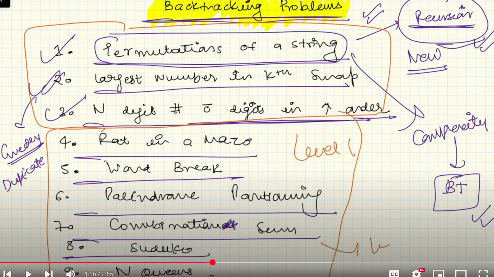

## Backtracking

1.


2.


3.


4.


5.


Problem: 
https://www.geeksforgeeks.org/problems/permutations-of-a-given-string2041/1<br>
Given a string s, which may contain duplicate characters, your task is to generate and return an array of all unique permutations of the string. You can return your answer in any order.

The below solution uses Recurion not BT.
```c++
#include<vector>
#include<string>
#include<unordered_set>
#include <iostream>

using namespace std;

void permute(string ip, string op, vector<string> &v)
{
    if (ip.size() == 0) //<== controlled recursion
    {
        v.push_back(op);
        return;
    }

    unordered_set<char> mp;
    for (int i = 0; i < ip.size(); i++) //<== for Choices loop
    {
        if (mp.find(ip[i]) == mp.end()) //<== controlled condition
        {
            mp.insert(ip[i]);
            string newip = ip.substr(0, i) + ip.substr(i + 1);

            string newop = op + ip[i];
            cout << i << ", ip: " << ip << ", newip: " << newip << ", newop: " << newop << endl;
            permute(newip, newop, v); //<== passing by value so not a BackTracking solution; if we pass ip as reference and not use op, it will turn into a BT solution
        }
    }
}

vector<string> find_permutation(string S)
{
    // Code here there
    vector<string> v;
    permute(S, "", v);
    return v;
}

int main() {
    // Write C++ code here
    std::cout << "Welcome" << endl;
    auto v = find_permutation("abc");
    for(auto s: v)
        cout << s << endl;
    return 0;
}
```

### Time complexity of Recursive Tree in above code

Time complxity = Time complexity of one node X number of nodes in the tree

Above tree will have nodes like this which comes out to be n!


A balance tree will be 2 pow n.


### Using BackTracking for above problme
```c++
class Solution
{
	public:
		vector<string>find_permutation(string S)
		{
		    // Code here there
		    set<string> ans;
		    permutations(S,0,ans);
		    vector<string> vc(ans.begin(), ans.end());
		    
		    return vc;
		}
		void permutations(string &s, int start, set<string> &ans){
		    if(start == s.size()-1){
		        ans.insert(s);
		        return;
		    }
		    
		    unordered_map<char,int> mp;
		    for(int i = start; i < s.size(); i++){
		        if(mp.find(s[i]) == mp.end()){
		            mp[s[i]]++;
		            
		            if(s[i] != s[start]){
		                swap(s[i],s[start]);
		                permutations(s,start+1,ans);
		            // backtracking step
		            swap(s[i],s[start]);
		                
		            }
		            else
		               permutations(s,start+1,ans);
		        }
		    }
		}
};
```
