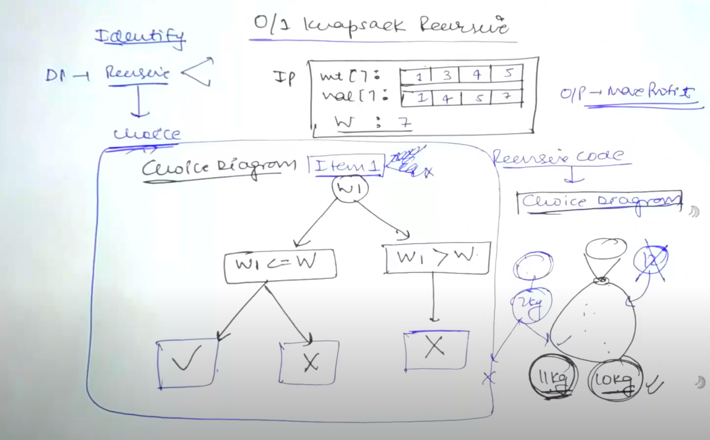

## Dynamic Programming (DP) - Choice and Optimal => Recursion + Storage

- Just an enhanced recursion (there will be choice)
- If you need to make 2 calls in the recursion, most likely DP will be used
- You save the results in a table and use that in your recursive solution
- Usually optimal is asked in questions

- Parent of DP is recursion
- Write recursive function first <- This is must
  
- Next either (1) Memoize the solution (Recusrion + Table cache) or use (2) Bottom Up (No Recursion, only Table) next
- Using either of these approaches is Dynamic Programming

### Type of Problems
Most of them are just variations of these<br>
⁃	0-1 knapsack (6)<br>
⁃	Unbounded knapsack (5)<br>
⁃	Fibonacci (+)<br>
⁃	LCS (15)<br>
⁃	LIS (10)<br>
⁃	Kadane's Algorithm (6)<br>
⁃	Matrix chain multiplication (7)<br>
⁃	DP on Trees (4)<br>
⁃	DP on Grid (14)<br>
⁃	Others (5)<br>

### KnapSack Problem
Here's an explanation of each variation mentioned:
- Subset Sum:<br>
Problem: Given a set of integers and a target sum, determine if there exists a subset of the integers that sums to the target.<br>
Relation to Knapsack: Similar to the 0-1 Knapsack where instead of maximizing value, you're checking if you can achieve a specific sum with a subset of items (weights).
- Equal Sum Partition:<br>
Problem: Determine if the given set of integers can be partitioned into two subsets with equal sum.<br>
Relation to Knapsack: This is a special case of the Subset Sum problem where the target sum is half of the total sum of the set.
- Count of Subset Sum:<br>
Problem: Count the number of subsets of a given set of integers that sum to a target value.<br>
Relation to Knapsack: Instead of finding if there's a solution, this counts how many solutions exist for the subset sum problem.
- Minimum Subset Sum Difference:<br>
Problem: Find the minimum possible difference between the sums of two subsets of a given set of integers.<br>
Relation to Knapsack: This can be approached by considering all possible subset sums and finding the closest sum to half the total sum, which minimizes the difference.
- Target Sum:<br>
Problem: Given a list of integers and a target sum, find the number of ways to assign '+' or '-' signs to the integers such that their sum equals the target.<br>
Relation to Knapsack: This can be transformed into a subset sum problem by considering the positive and negative contributions as different subsets.
- Number of Subsets Given:<br>
Problem: This seems to be a general note or might refer to problems where you need to find or count subsets with specific properties or constraints.<br>
Relation to Knapsack: Could relate to variations where the number of items in subsets is considered, like finding subsets with a specific count of elements.

**0/1 Knapsack Problem**
https://www.geeksforgeeks.org/0-1-knapsack-problem-dp-10/

Given N items where each item has some weight and profit associated with it and also given a bag with capacity W, [i.e., the bag can hold at most W weight in it]. The task is to put the items into the bag such that the sum of profits associated with them is the maximum possible. <br><br>

Note: The constraint here is we can either put an item completely into the bag or cannot put it at all [It is not possible to put a part of an item into the bag].

Start by making a choice diagram, that makes it easy to figure out recursion


```c++
int knapsack(int wt[], int val[], int W, int n)
{
	BASE CONDITION <- First ingredient of REcursion
 	CHOICE DIAGRAM <- 2nd ingredient of Recursion
}
```

Base Condition - Think of smallest valid input (in this case, arr size, n could be 0, or W = 0)
```c++
if(n ==0 || W ==0)
	return 0
```

Recursive Function: Call on smaller input so that it can finish, fib(n). fib(n-1)....

For each w we have 2 choices
1) w > W [Dont include]
2) w <= W [2 choices - Include or Dont Include]

If we include: use val of w + find val for remaining weight [W - w] and n-1 items
If we dont include: find val for weight W with remaining items n-1

**Recursive Approach - NO DP involved**
```c++
#include <iostream>
#include <vector>
using namespace std;

// Returns the maximum value that
// can be put in a knapsack of capacity W
int knapSack(int W, vector<int>& wt, vector<int>& val, int n) {
  
    // Base Case
    if (n == 0 || W == 0)
        return 0;

    // If weight of the nth item is more
    // than Knapsack capacity W, then
    // this item cannot be included
    // in the optimal solution
    if (wt[n - 1] > W)
        return knapSack(W, wt, val, n - 1);

    // Return the maximum of two cases:
    // (1) nth item included
    // (2) not included
    return max(val[n - 1] + knapSack(W - wt[n - 1], wt, val, n - 1),
		knapSack(W, wt, val, n - 1));
}

// Driver code
int main() {
    vector<int> profit = {60, 100, 120};
    vector<int> weight = {10, 20, 30};
    int W = 50;

    cout << knapSack(W, weight, profit, profit.size()) << endl;
    return 0;
}
```

**Converting above in DP is easy / Memoization = Recurive Calls + Table cache**
- Look for vatiables that are changing -> W and n
- Make a matrix of those 2, lets say t or dp
- initialize the matrix by -1
```
int t[n+1][W+1]; //We WANT To store o...n and 0...W so n+1, W+1 is needed for size (1 extra)
memset(t, -1, sizeof(t))
```

Add 2 steps:
- chcek if value is already in our matrix and return if it is
- save it in matrix and then return from matrix


Since we dont know the W and n, we can also look at constraints and create a bigger global matrix such as: int t[100][100]

using vector:
```c++
#include <iostream>
#include <vector>
using namespace std;

// Returns the value of maximum profit
int kSackRec(int W, vector<int>& wt, vector<int>& val, 
             int index, vector<vector<int>>& memo) {
  
    // Base condition
    if (index < 0)
        return 0;

    if (memo[index][W] != -1)
        return memo[index][W];

    // Store the value in the table before return
    if (wt[index] > W) {        
        memo[index][W] = kSackRec(W, wt, val, index - 1, memo);
    } else {
        memo[index][W] = max(val[index] + 
                             kSackRec(W - wt[index], wt, val, index - 1, memo),
                             kSackRec(W, wt, val, index - 1, memo));
    }

    return memo[index][W];
}

int kSack(int W, vector<int>& wt, vector<int>& val) {
    int n = wt.size();
    vector<vector<int>> memo(n, vector<int>(W + 1, -1));
    return kSackRec(W, wt, val, n - 1, memo);
}

// Driver Code
int main() {
    vector<int> profit = {60, 100, 120};
    vector<int> weight = {10, 20, 30};
    int W = 50;
    cout << kSack(W, weight, profit) << endl;
    return 0;
}

```

**Converting to Bottom Up approach /Tabulation = No Recursive calls <== This is best approach as no recursion involved**
size of matrix?<br>
Let wt[] = [1,3,4,5]<br>
Let val[] = [1,4,5,7]<br>

so here n is 4 and w is 7; so matrix will be:<br>
t[n+1][w+1] //accounts for 0<br>
t[5][8] //5 rows (0 to 4) and 8 columns (0 to 7)<br>

Base condition of recursive function will change to initialization

```c++
#include <iostream>
#include <vector>
using namespace std;

// Returns the maximum value that
// can be put in a knapsack of capacity W
int knapSack(int W, vector<int>& wt, vector<int>& val) {
    int n = wt.size();
    vector<vector<int>> dp(n + 1, vector<int>(W + 1));

    // Build table dp[][] in bottom-up manner
    for (int i = 0; i <= n; i++) {
        for (int w = 0; w <= W; w++) {
            if (i == 0 || w == 0)
                dp[i][w] = 0; //<initialization
            else if (wt[i - 1] <= w)
                dp[i][w] = max(val[i - 1] + dp[i - 1][w - wt[i - 1]], 
                               dp[i - 1][w]);
            else
                dp[i][w] = dp[i - 1][w];
        }
    }
    return dp[n][W];
}

// Driver Code
int main() {
    vector<int> profit = {60, 100, 120};
    vector<int> weight = {10, 20, 30};
    int W = 50;

    cout << knapSack(W, weight, profit) << endl;

    return 0;
}
```

## Subset Sum Problem
arr = [2,3,7,8,10], target sum = 11
so we will create a matrix of 6 x 12.

This is similar to knapsack, consider arr as values and target sum as weight W that sack can hold


Given an array arr[] of non-negative integers and a value sum, the task is to check if there is a subset of the given array whose sum is equal to the given sum. 

Examples: 

Input: arr[] = {3, 34, 4, 12, 5, 2}, sum = 9<br>
Output: True<br>
Explanation: There is a subset (4, 5) with sum 9.<br>


Input: arr[] = {3, 34, 4, 12, 5, 2}, sum = 30<br>
Output: False<br>
Explanation: There is no subset that add up to 30.<br>

Solution: So we will create a 2D array of size (n + 1) * (sum + 1) of type boolean. The state dp[i][j] will be true if there exists a subset of elements from arr[0 . . . i] with sum = ‘j’. 


The dynamic programming relation is as follows: 
```py
if (arr[i-1] > j)
    dp[i][j] = dp[i-1][j]
else 
    dp[i][j] = dp[i-1][j] OR dp[i-1][j-arr[i-1]]
```

```c++
//C++ implementation for subset sum
// problem using tabulation
#include <bits/stdc++.h>
using namespace std;

// Function to check if there is a subset of arr[]
// with sum equal to the given sum using tabulation with vectors
bool isSubsetSum(vector<int> &arr, int sum) {
    int n = arr.size();

    // Create a 2D vector for storing results
      // of subproblems
    vector<vector<bool>> dp(n + 1, vector<bool>(sum + 1, false));

    // If sum is 0, then answer is true (empty subset)
    for (int i = 0; i <= n; i++)
        dp[i][0] = true;

    // Fill the dp table in bottom-up manner
    for (int i = 1; i <= n; i++) {
      
        for (int j = 1; j <= sum; j++) {
            if (j < arr[i - 1]) {
              
               // Exclude the current element
                dp[i][j] = dp[i - 1][j]; 
            }
            else {
              
               // Include or exclude
                dp[i][j] = dp[i - 1][j] 
                || dp[i - 1][j - arr[i - 1]];
            }
        }
    }

    return dp[n][sum];
}

int main() {

    vector<int> arr = {3, 34, 4, 12, 5, 2};
    int sum = 9;

    if (isSubsetSum(arr, sum))
        cout << "True" << endl;
    else
        cout << "False" << endl;

    return 0;
}
```
