# LeetCode Patterns to Master Coding Interviews

This README summarizes the essential LeetCode patterns for solving coding interview questions efficiently, as described in the article ["14 LeetCode Patterns to Solve Any Question"](https://medium.com/@shubhamkumarcode/14-leetcode-patterns-to-solve-any-question-1dcdcc650bfa). These patterns provide generalized strategies to tackle a wide range of problems, reducing the need to memorize hundreds of individual solutions. Each pattern is outlined below with its use case, benefits, and example LeetCode problems.

## Table of Contents
1. [Sliding Window](#sliding-window)
2. [Two Pointers](#two-pointers)
3. [Fast & Slow Pointers](#fast--slow-pointers)
4. [In Place Linked List Reversal](#In-Place-Linked-List-Reversal)
5. [Binary Search](#binary-search)
6. [Top K Elements](#Top-K-Elements)
7. [Binary Tree Traversal](#Binary-Tree-Traversal)
8. [Graph and Matrices](#Graph-and-Matrices)
   - [Depth First Search (DFS)](#depth-first-search-dfs)
   - [Breadth First Search (BFS)](#breadth-first-search-bfs)
   - [Topological Sort](#topological-sort)
   - [DFS and BFS for Matrix Traversal](#DFS-and-BFS-for-Matrix-Traversal)
9. [Backtracking](#backtracking)
10. [Dynamic Programming](#dynamic-programming)
11. [Bit Manipulation](#bit-manipulation)
12. [Overlapping Intervals](#Overlapping-Intervals)
13. [Monotonic Stack](#Monotonic-Stack)
14. [Monotonic deque](#Monotonic-deque)
15. [Prefix Sum](#Prefix-Sum)
16. [Union Find](#union-find)
17. [Trie](#trie)
18. [Greedy](#greedy)


## Sliding Window
**Use Case**: Find subarrays or substrings that satisfy a specific condition, such as the maximum sum of a subarray of size k or the longest substring without repeating characters.  

**Benefit**: Reduces time complexity from O(n²) to O(n) by maintaining a dynamic window that expands or shrinks based on conditions.  

**Example Problems**:  
- Maximum Average Subarray I (LeetCode #643)  
- Longest Substring Without Repeating Characters (LeetCode #3)  
- Minimum Window Substring (LeetCode #76)

### Fixed Window:

The general steps to solve these questions by following below steps:

- Find the size of the window required, say K.
- Compute the result for 1st window, i.e. include the first K elements of the data structure.
- Then use a loop to slide the window by 1 and keep computing the result window by window.

In the sliding window, you have 2 pointers, i and j. Move j as far as you can until your condition is no longer valid, then move the i pointer closer to j until the condition is valid again to shrink the window. At every iteration, keep track of the min/max length of the subarray for the result. Without the sliding window technique, we would need to use a double for loop resulting in O(N²) time. The sliding window is O(N) time complexity.

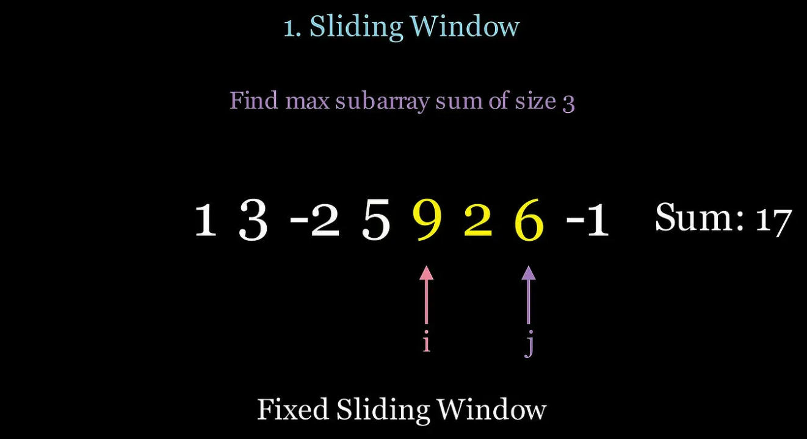

### Dynamic Sliding Window:


The general steps to solve these questions by following below steps:

- In this type of sliding window problem, we increase our right pointer one by one till our condition is true.
- we shrink the size of our window by increasing left pointer till it becomes invalid
- Again, move right pointer till it becomes valid
- We follow these steps until we reach to the end of the array.

In the dynamic sliding window, the size of the window (subarray between i and j) changes throughout the algorithm. In this example, we scan the subarray “bacb” and find that we have a duplicate “b”, so we will move the i pointer to shrink the window and move on to letter “a”, resulting in “acb”, then we start moving j again.

```py
"""
A generic template for dynamic sliding window finding min window length
"""
def shortest_window(nums, condition):
    i = 0
    min_length = float('inf')
    result = None

    for j in range(len(nums)):
        # Expand the window
        # Add nums[j] to the current window logic

        # Shrink window as long as the condition is met
        while condition():  
            # Update the result if the current window is smaller
            if j - i + 1 < min_length:
                min_length = j - i + 1
                # Add business logic to update result

            # Shrink the window from the left
            # Remove nums[i] from the current window logic
            i += 1

    return result

"""
A generic template for dynamic sliding window finding max window length
"""
def longest_window(nums, condition):
    i = 0
    max_length = 0
    result = None

    for j in range(len(nums)):
        # Expand the window
        # Add nums[j] to the current window logic

        # Shrink the window if the condition is violated
        while not condition():  
            # Shrink the window from the left
            # Remove nums[i] from the current window logic
            i += 1

        # Update the result if the current window is larger
        if j - i + 1 > max_length:
            max_length = j - i + 1
            # Add business logic to update result

    return result

"""
A generic template for sliding window of fixed size
"""
def window_fixed_size(nums, k):
    i = 0
    result = None

    for j in range(len(nums)):
        # Expand the window
        # Add nums[j] to the current window logic

        # Ensure window has size of K
        if (j - i + 1) < k:
            continue

        # Update Result
        # Remove nums[i] from window
        # increment i to maintain fixed window size of length k
        i += 1

    return result
```
### LeetCode Questions
- .3. Longest Substring Without Repeating Characters
- .424. Longest Repeating Character Replacement
- .1876. Substrings of Size Three with Distinct Characters
- .76. Minimum Window Substring


## Two Pointers
**Use Case**: Solve problems involving sorted arrays or linked lists, such as finding pairs that sum to a target or removing duplicates.  

**Benefit**: Achieves O(n) time complexity by moving two pointers toward each other or in the same direction based on problem constraints.  

**Example Problems**:  
- Two Sum II - Input Array is Sorted (LeetCode #167)  
- Remove Duplicates from Sorted Array (LeetCode #26)  
- Container With Most Water (LeetCode #11)

**Technique**:
Instead of scanning all possible subarrays or substrings, use two pointers i and j at the ends of a string or sorted array to be clever how you increment i or decrement j as you scan the input. This will lower your time complexity from O(N²) to O(N). In the example above, to detect if a string is a palindrome we scan the ends of the string one character at a time. If the characters are equal, move i and j closer together. If they are not equal, the string is not a palindrome.

### Is string a Palindrome? "RACECAR"
```py
def two_pointer_template(input):
    # Initialize pointers
    i = 0
    j = len(input) - 1
    result = None
     
    # Iterate while pointers do not cross
    while i < j:
        # Process the elements at both pointers
        # Adjust the pointers based on specific conditions
        # i += 1 or j -= 1
        # Break or continue based on a condition if required
    # Return the final result or process output
    return result
```
### LeetCode Questions
- .125. Valid Palindrome
- .15. 3Sum
- .11. Container With Most Water


## Fast & Slow Pointers
**Use Case**: Detect cycles, find midpoints, or identify specific positions in linked lists or arrays (e.g., cycle detection in a linked list).  

**Benefit**: Provides an efficient O(n) solution for cycle detection and related problems using two pointers moving at different speeds.  

**Technique**:
Use two pointers, a slow and fast pointer. Slow moves once and fast moves twice at every iteration. Instead of using a data structure to store previous nodes to detect a cycle which requires O(N) space, using the two pointer technique will find a cycle with O(1) space if fast loops around the cycle and will eventually meet slow. You can also use this technique to find the middle of a linked list in O(1) space and 1 pass.

3 -> 2 -> [0] -> 4 -> [[1]]

```py
def slow_fast_pointers(head):
    # Initialize pointers
    slow = head
    fast = head
    result = None

    # move slow once, move fast twice
    while fast and fast.next:
        slow = slow.next
        fast = fast.next.next
        # update result based on custom logic
        # Example: if fast == slow then cycle is detected
    return result
```
**Example Problems**:  
- Find the Duplicate Number (LeetCode #287)  
- Middle of the Linked List (LeetCode #876)
- .141. Linked List Cycle
- .142. Linked List Cycle II
- .19. Remove Nth Node From End of List


## In Place Linked List Reversal
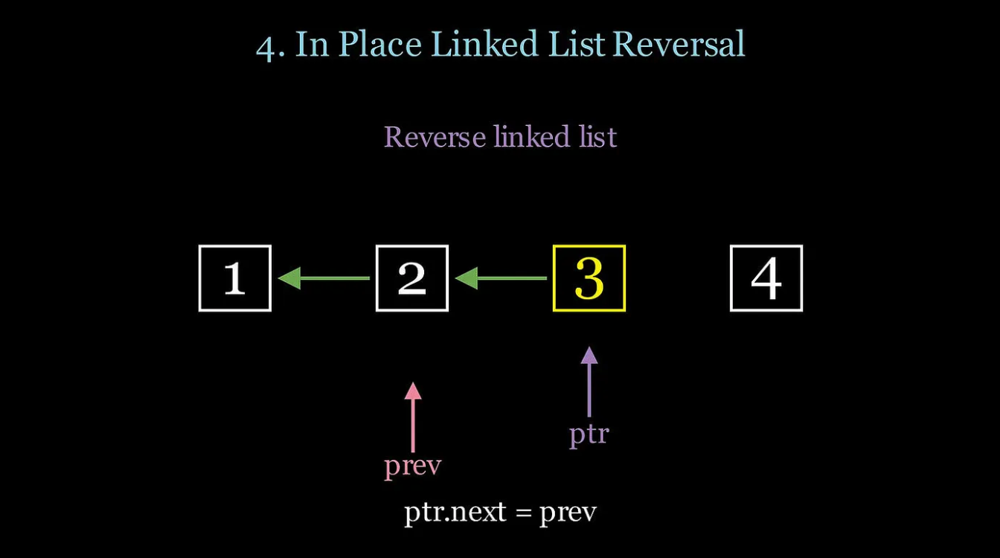

### When to use it?
- Reverse a linked list in 1 pass and O(1) space
- Reverse a specific portion of a linked list
- Reverse nodes in groups of K

### Technique
Use two pointers, prev and ptr which point to the previous and current nodes. To reverse a linked list, ptr.next = prev. Then, move prev to ptr and move ptr to the next node. At the end of the algorithm, prev will point to the head of the reversed list.

```py
def reverse_linked_list(head):
    prev = None
    ptr = head 
    
    while ptr:
        # Save the next node
        next_node = ptr.next
        # Reverse the current node's pointer
        ptr.next = prev
        # Move the pointers one step forward
        prev = ptr
        ptr = next_node
    # prev is the new head after the loop ends
    return prev
```
### LeetCode Questions
- .206. Reverse Linked List
- .143. Reorder List
- .25. Reverse Nodes in k-Group


## Binary Search
**Use Case**: Search for a target in a sorted array or find boundaries, such as the first or last occurrence of an element.  

**Benefit**: Reduces time complexity to O(log n) by halving the search space in each iteration.  

**Example Problems**:  
- Binary Search (LeetCode #704)  
- Find First and Last Position of Element in Sorted Array (LeetCode #34)  
- Search in Rotated Sorted Array (LeetCode #33)

### Technique
Start left and right pointers at indices 0 and n-1, then find the mid point and see if that is equal to, less than, or greater than your target. If nums[mid] > target, go left by moving the right pointer to mid-1. If nums[mid] < target, go right by moving left to mid+1. Binary Search reduces search time complexity from O(N) to O(NLogN)

```py
"""
Classic binary search algorithm that finds a target value
"""
def classic_binary_search(array, target):
    left, right = 0, len(array)-1
    while left <= right:
        mid = left + (right - left) // 2
        if array[mid] == target:
            return mid
        elif array[mid] < target:
            left = mid + 1
        else:
            right = mid - 1
    return -1

"""
A generic template for binary search such that the returned value
is the minimum index where condition(k) is true
Example 1:
array = [1,2,2,2,3]
target = 2
binary_search(array, lambda mid: array[mid] >= target) --> 1
Example 2:
array = [1,2,2,2,3]
target = 2
binary_search(array, lambda mid: array[mid] > target) --> 4
"""
def binary_search(array, condition):
    left, right = 0, len(array)
    while left < right:
        mid = left + (right - left) // 2
        if condition(mid):
            right = mid
        else:
            left = mid + 1
    return left
"""
Binary search algorithm that can search a rotated array
by selected the appropriate half to scan at each iteration
"""
def binary_search_rotated_array(array, target):
    left, right = 0, len(array)-1
    while left <= right:
        mid = (left + right) // 2
        if array[mid] == target:
            return mid
        # left side sorted
        if array[left] <= array[mid]:
            # if target is contained in left sorted side, go left
            if array[left] <= target <= array[mid]:
                right = mid - 1
            else:
                left = mid + 1
        # right side sorted
        else:
            # if target is contained in right sorted side, go right
            if array[mid] <= target <= array[right]:
                left = mid + 1
            else:
                right = mid - 1
    return -1
```
### LeetCode Questions
- .34. Find First and Last Position of Element in Sorted Array
- .153. Find Minimum in Rotated Sorted Array
- .33. Search in Rotated Sorted Arra


## Top K Elements

### When to use it?
- Find the top k smallest or largest elements
- Find the kth smallest or largest element
- Find the k most frequent elements

### Technique
You can always sort an array and then take the first or last k elements, however the time complexity would be O(NLogN). A heap can pop and push elements in O(Log(K)) where K is the size of the heap. Therefore, instead of sorting, we can use a heap to hold the smallest or largest K values, and for every element in the array check whether to pop/push to the heap, resulting in a time complexity of O(NLogK).

```c++
#include <vector>
#include <queue>

std::vector<int> top_k_smallest_elements(const std::vector<int>& arr, int k) {
    // Handle edge cases
    if (k <= 0 || arr.empty()) {
        return {};
    }

    // Use a max-heap to maintain the k smallest elements
    std::priority_queue<int> max_heap; //LARGEST value is at TOP, hence max_heap; std::less<int> by default
    for (int num : arr) {
        max_heap.push(num); //PUSH
        if (max_heap.size() > static_cast<size_t>(k)) {
            max_heap.pop(); // Remove the largest element as LARGEST is on top
        }
    }

    // Extract elements from the heap
    std::vector<int> result;
    while (!max_heap.empty()) {
        result.push_back(max_heap.top());
        max_heap.pop();
    }

    // Reverse to get smallest to largest order (optional, depending on requirements)
    std::reverse(result.begin(), result.end());
    return result;
}

std::vector<int> top_k_largest_elements(const std::vector<int>& arr, int k) {
    // Handle edge cases
    if (k <= 0 || arr.empty()) {
        return {};
    }

    // Use a min-heap to maintain the k largest elements
    std::priority_queue<int, std::vector<int>, std::greater<int>> min_heap; //MIN value on top; they are in incrasing order
    for (int num : arr) {
        min_heap.push(num);
        if (min_heap.size() > static_cast<size_t>(k)) {
            min_heap.pop(); // Remove the smallest element
        }
    }

    // Extract elements from the heap
    std::vector<int> result;
    while (!min_heap.empty()) {
        result.push_back(min_heap.top());
        min_heap.pop();
    }

    // Reverse to get largest to smallest order (optional, depending on requirements)
    std::reverse(result.begin(), result.end());
    return result;
}

#include <iostream>

int main() {
    std::vector<int> arr = {7, 2, 5, 3, 9, 1, 8};
    int k = 3;

    // Top K smallest
    std::vector<int> smallest = top_k_smallest_elements(arr, k);
    std::cout << "Top " << k << " smallest: ";
    for (int num : smallest) {
        std::cout << num << " ";
    }
    std::cout << std::endl; // Output: 1 2 3

    // Top K largest
    std::vector<int> largest = top_k_largest_elements(arr, k);
    std::cout << "Top " << k << " largest: ";
    for (int num : largest) {
        std::cout << num << " ";
    }
    std::cout << std::endl; // Output: 9 8 7

    return 0;
}
```

### LeetCode Questions
- .215. Kth Largest Element in an Array
- .347. Top K Frequent Elements
- .23. Merge k Sorted Lists


## Binary Tree Traversal

### When to use it?
- Preorder: Serialize or deserialize a tree
- Inorder: Retrieve elements in sorted order (BSTs)
- Postorder: Process children before parent (bottom-up)
- BFS: Level by level scanning

### Technique
For the preorder, inorder, and postorder traversals use recursion (DFS). For the level by level scan use BFS iteratively with a queue.

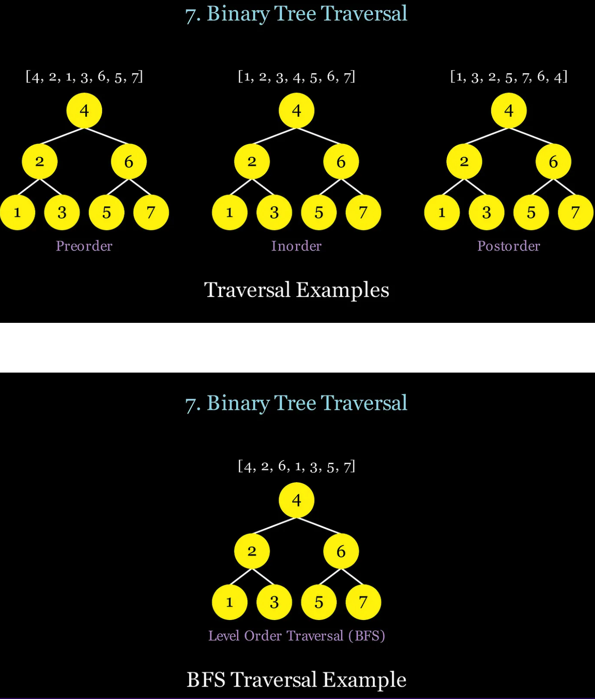

```cpp
// Tree node structure
struct TreeNode {
    int val;
    TreeNode* left;
    TreeNode* right;
    
    TreeNode(int x) : val(x), left(nullptr), right(nullptr) {}
};

/**
 * Preorder traversal: visit node, then left subtree, then right subtree.
 */
void preorder_traversal(TreeNode* node) {
    if (!node) {
        return;
    }
    // visit node
    cout << node->val << " ";
    preorder_traversal(node->left);
    preorder_traversal(node->right);
}

/**
 * Inorder traversal: visit left subtree, then node, then right subtree.
 */
void inorder_traversal(TreeNode* node) {
    if (!node) {
        return;
    }
    inorder_traversal(node->left);
    // visit node
    cout << node->val << " ";
    inorder_traversal(node->right);
}

/**
 * Postorder traversal: visit left subtree, then right subtree, then node
 */
void postorder_traversal(TreeNode* node) {
    if (!node) {
        return;
    }
    postorder_traversal(node->left);
    postorder_traversal(node->right);
    // visit node
    cout << node->val << " ";
}

/**
 * BFS traversal: Visit all nodes level by level using a queue
 */

void bfs_traversal(Node* root) {
    if (!root) {
        return;
    }

    // Use a queue to store nodes
    std::queue<Node*> queue;
    queue.push(root);

    while (!queue.empty()) {
        // Get the front node
        Node* node = queue.front();
        queue.pop();

        // Visit node (print value in this case)
        std::cout << node->val << " ";

        // Enqueue left child if it exists
        if (node->left) {
            queue.push(node->left);
        }

        // Enqueue right child if it exists
        if (node->right) {
            queue.push(node->right);
        }
    }
}
```
### LeetCode Questions
- .104. Maximum Depth of Binary Tree
- .102. Binary Tree Level Order Traversal
- .105. Construct Binary Tree from Preorder and Inorder Traversal
- .124. Binary Tree Maximum Path Sum


## Graph and Matrices

When to use it?

- Search graphs or matrices
- DFS: Explore all possible paths (e.g., maze)
- BFS: Find the shortest path
- Topological Sort: Order tasks based on dependencies

## Depth First Search (DFS)
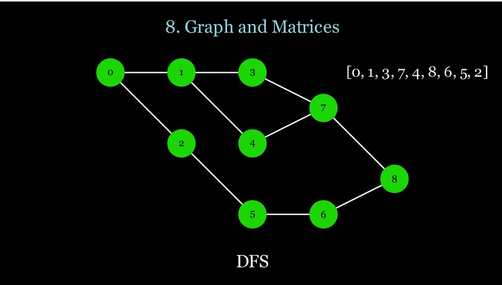

### Technique:
DFS (Depth-First Search) traverses as deep as possible along each branch before backtracking, prioritizing visiting nodes or cells in a recursive or stack-based manner. BFS (Breadth-First Search) explores all neighbors of a node or cell before moving deeper, traversing level by level using a queue. For DFS use recursion with a visited set to keep track of visited nodes. For BFS use iteration with a queue and a visited set to keep track of visited nodes. In a graph, neighbors are found in the adjacency list.

**Use Case**: Traverse trees or graphs to explore all possible paths, such as finding connected components or validating properties of a tree.  

**Benefit**: Ideal for problems requiring exhaustive exploration of paths or recursive solutions.  
```py
"""
DFS for a graph represented as an adjacency list
"""
def dfsRec(adj, visited, s, res):
    visited[s] = True
    res.append(s)

    # Recursively visit all adjacent vertices that are not visited yet
    for i in range(len(adj)):
        if adj[s][i] == 1 and not visited[i]:
            dfsRec(adj, visited, i, res)

def DFS(adj):
    visited = [False] * len(adj)
    res = []
    dfsRec(adj, visited, 0, res)  # Start DFS from vertex 0
    return res


def add_edge(adj, s, t):
    adj[s][t] = 1
    adj[t][s] = 1  # Since it's an undirected graph


# Driver code
V = 5
adj = [[0] * V for _ in range(V)]  # Adjacency matrix

# Define the edges of the graph
edges = [(1, 2), (1, 0), (2, 0), (2, 3), (2, 4)]

# Populate the adjacency matrix with edges
for s, t in edges:
    add_edge(adj, s, t)

res = DFS(adj)  # Perform DFS
print(" ".join(map(str, res)))
```

```c++
#include <bits/stdc++.h>
using namespace std;

// Recursive function for DFS traversal
void dfsRec(vector<vector<int>> &adj, vector<bool> &visited, int s, vector<int> &res)
{

    visited[s] = true;

    res.push_back(s);

    // Recursively visit all adjacent vertices
    // that are not visited yet
    for (int i : adj[s])
        if (visited[i] == false)
            dfsRec(adj, visited, i, res);
}

// Main DFS function that initializes the visited array
// and call DFSRec
vector<int> DFS(vector<vector<int>> &adj)
{
    vector<bool> visited(adj.size(), false);
    vector<int> res;
    dfsRec(adj, visited, 0, res);
    return res;
}

// To add an edge in an undirected graph
void addEdge(vector<vector<int>> &adj, int s, int t)
{
    adj[s].push_back(t);
    adj[t].push_back(s);
}

int main()
{
    int V = 5;
    vector<vector<int>> adj(V);

    // Add edges
    /*
    1-- 2 -- 4
    | / |
    0   3
    */
    vector<vector<int>> edges = {{1, 2}, {1, 0}, {2, 0}, {2, 3}, {2, 4}};
    for (auto &e : edges)
        addEdge(adj, e[0], e[1]);

    // Starting vertex for DFS
    vector<int> res = DFS(adj); // Perform DFS starting from the source verte 0;

    for (int i = 0; i < V; i++)
        cout << res[i] << " ";  //Output: 0 1 2 3 4
}

```

**Example Problems**:  
- Number of Islands (LeetCode #200)  
- Validate Binary Search Tree (LeetCode #98)  
- Path Sum (LeetCode #112)

## Breadth First Search (BFS)
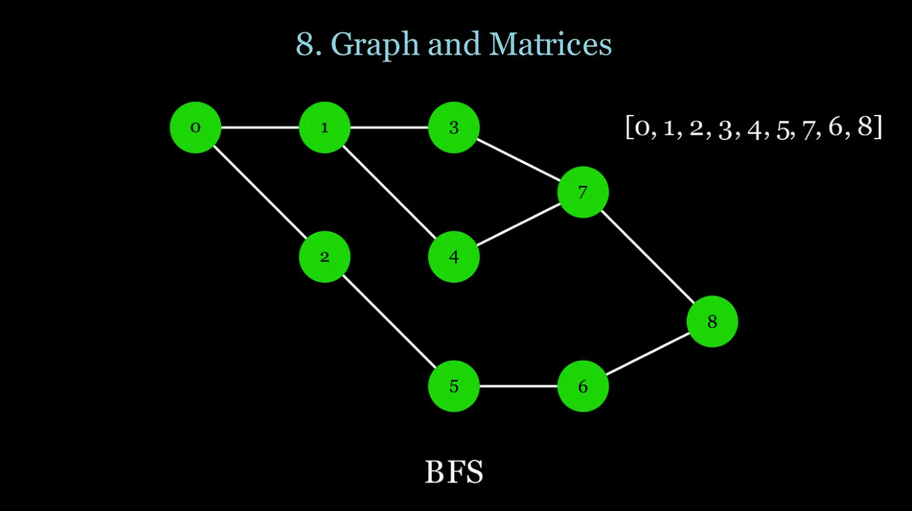

**Use Case**: Find the shortest path in unweighted graphs or perform level-order traversal in trees.  

**Benefit**: Guarantees the shortest path in unweighted graphs and handles level-by-level processing efficiently.  

```py
"""
BFS for a graph represented as an adjacency list
"""
from collections import deque
def bfs(graph, start):
    visited = set()
    result = []
    
    queue = deque([start])
    while queue:
        node = queue.pop()
        if node not in visited:
            visited.add(node)
            result.append(node)  # process node
            for neighbor in graph[node]:
                queue.append(neighbor)
    return result
```
**Example Problems**:  
- Binary Tree Level Order Traversal (LeetCode #102)  
- Word Ladder (LeetCode #127)  
- Rotten Oranges (LeetCode #994)

  
## Topological Sort
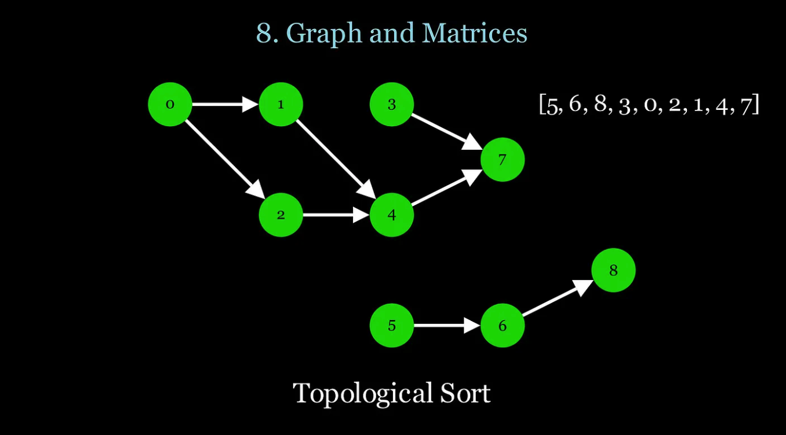

**Use Case**: Schedule tasks with dependencies or resolve prerequisites, such as course scheduling in a directed acyclic graph (DAG).  

**Benefit**: Provides a linear ordering of nodes in a DAG, useful for dependency resolution.  

```c++
/**
 * Topological Sort only works on DAG graphs with no cycles
 */
class TopologicalSort {
private:
    const unordered_map<int, vector<int>>& graph;
    unordered_set<int> visited;
    vector<int> topo_order;
    
    bool hasCycle(int node, unordered_set<int>& curpath) {
        visited.insert(node);
        curpath.insert(node);
        
        // Check if node exists in graph
        if (graph.find(node) != graph.end()) {
            for (int neighbor : graph.at(node)) {
                if (curpath.count(neighbor)) { // cycle detected, no topo sort
                    return true;
                }
                if (visited.count(neighbor)) {
                    continue;
                }
                if (hasCycle(neighbor, curpath)) {
                    return true;
                }
            }
        }
        
        curpath.erase(node);
        topo_order.push_back(node); // process node
        return false;
    }
    
public:
    TopologicalSort(const unordered_map<int, vector<int>>& g) : graph(g) {}
    
    vector<int> sort() {
        visited.clear();
        topo_order.clear();
        
        for (const auto& [node, neighbors] : graph) {
            if (visited.count(node) == 0) {
                unordered_set<int> curpath;
                if (hasCycle(node, curpath)) {
                    return {}; // cycle detected, no topo sort (return empty vector)
                }
            }
        }
        
        // reverse to get the correct topological order
        reverse(topo_order.begin(), topo_order.end());
        return topo_order;
    }
};

vector<int> topological_sort(const unordered_map<int, vector<int>>& graph) {
    TopologicalSort ts(graph);
    return ts.sort();
}
```
**Example Problems**:  
- Course Schedule (LeetCode #207)  
- Alien Dictionary (LeetCode #269)  
- Sequence Reconstruction (LeetCode #444)
  

## DFS and BFS for Matrix Traversal
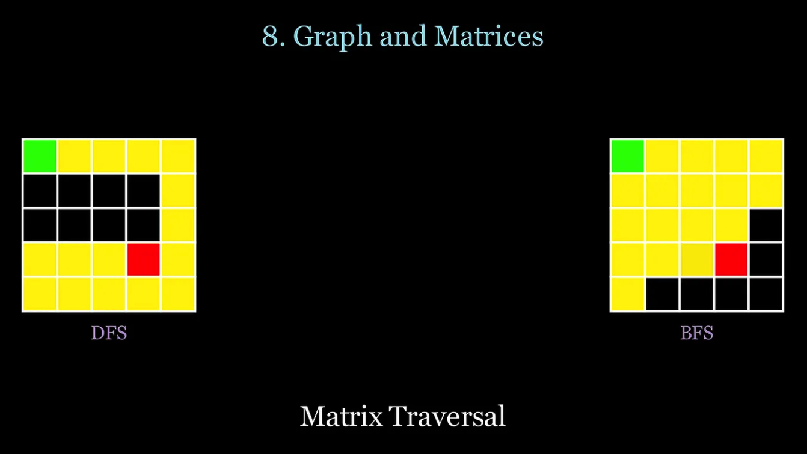

In a matrix, neighbors are up/down/left/right cells, with some examples including diagonals too.
```c++
#include <vector>
#include <set>
#include <queue>
#include <utility>

using namespace std;

/**
 * DFS for a matrix, visiting all connected cells.
 */
class MatrixDFS {
private:
    const vector<vector<int>>& matrix;
    int m, n;
    set<pair<int, int>> visited;
    vector<int> result;
    vector<pair<int, int>> directions;
    
    void explore(int i, int j) {
        if (i < 0 || i >= m || j < 0 || j >= n) {
            return;
        }
        if (visited.count({i, j})) {
            return;
        }
        visited.insert({i, j});
        result.push_back(matrix[i][j]);  // process the cell
        
        // Explore neighbors (up, down, left, right)
        for (auto& dir : directions) {
            explore(i + dir.first, j + dir.second);
        }
    }
    
    void dfs_driver() {
        for (int i = 0; i < m; i++) {
            for (int j = 0; j < n; j++) {
                if (visited.count({i, j}) == 0) {
                    explore(i, j);
                }
            }
        }
    }
    
public:
    MatrixDFS(const vector<vector<int>>& mat) 
        : matrix(mat), m(mat.size()), n(mat[0].size()),
          directions({{-1, 0}, {1, 0}, {0, -1}, {0, 1}}) {}
    
    vector<int> traverse() {
        visited.clear();
        result.clear();
        dfs_driver();
        return result;
    }
};

vector<int> dfs_matrix(const vector<vector<int>>& matrix) {
    MatrixDFS dfs(matrix);
    return dfs.traverse();
}

/**
 * BFS for a matrix, visiting all connected cells.
 */
vector<int> bfs_matrix(const vector<vector<int>>& matrix, int startI, int startJ) {
    int m = matrix.size();
    int n = matrix[0].size();
    set<pair<int, int>> visited;
    vector<int> result;
    queue<pair<int, int>> q;
    
    // Direction vectors for up, down, left, right
    vector<pair<int, int>> directions = {{-1, 0}, {1, 0}, {0, -1}, {0, 1}};
    
    q.push({startI, startJ});
    
    while (!q.empty()) {
        auto [i, j] = q.front();
        q.pop();
        
        if (i < 0 || i >= m || j < 0 || j >= n) {
            continue;
        }
        if (visited.count({i, j})) {
            continue;
        }
        
        visited.insert({i, j});
        result.push_back(matrix[i][j]);  // process the cell
        
        // Enqueue neighbors (up, down, left, right)
        for (auto& dir : directions) {
            q.push({i + dir.first, j + dir.second});
        }
    }
    
    return result;
}
```

### LeetCode Questions
- .79. Word Search
- .207. Course Schedule
- .994. Rotting Oranges
- .417. Pacific Atlantic Water Flow
- .127. Word Ladder


## Backtracking


### Technique
Backtracking is closely related to DFS, but with a focus on finding solutions while validating their correctness. If a solution doesn’t work, you backtrack by returning to the previous recursive state and trying a different option. Additionally, backtracking uses constraints to eliminate branches that cannot lead to a valid solution, making the search more efficient.

**Use Case**: Solve combinatorial problems like generating permutations, combinations, or solving puzzles (e.g., N-Queens).  

**Benefit**: Systematically explores all possibilities while pruning invalid paths to optimize performance.  

```py
#include <vector>
#include <iostream>
using namespace std;

class BacktrackingSolver {
private:
    // TODO: Add your data members here
    // Example: vector<int> currentSolution;
    // Example: vector<vector<int>> allSolutions;
    // Example: int target;
    
public:
    // Constructor - Initialize your problem-specific data
    BacktrackingSolver(/* TODO: Add parameters for your problem */) {
        // TODO: Initialize your data members
    }
    
    // Main backtracking function
    void backtrack(int level /* TODO: Add other parameters as needed */) {
        // BASE CASE: Check if we've found a complete solution
        if (isComplete(level)) { // Check complete ness ==> Example: currentSolution.size() == n; or level == n
            // TODO: Process the complete solution
            processSolution();
           // TODO: processSolution() ==> Handle the complete solution
           // Example: allSolutions.push_back(currentSolution);
           // Example: printSolution();
           // Example: solutionCount++;

            return;
        }
        
        // RECURSIVE CASE: Try all possible choices at this level
        vector<int> choices = generateChoices(level);
        // TODO: generateChoices() ==> Generate and return valid choices for this level
        // Example: return {1, 2, 3, 4, 5}; // for numbers 1-5
        // Example: return candidates; // from a pre-computed list
        
        for (int choice : choices) {
            // CHOOSE: Make the choice
            if (isValid(choice, level)) {
              // TODO: isValid() ==> Implement your validation logic
              // Example: return choice not already used
              // Example: return choice satisfies constraints

                makeChoice(choice, level);
                 // TODO: makeChoice() ==> Update your data structures to reflect the choice / Make a choice (add to current solution)
                 // Example: currentSolution.push_back(choice);
                 // Example: used[choice] = true;
                 // Example: board[row][col] = choice;
                
                // EXPLORE: Recursively solve the subproblem
                backtrack(level + 1);
                
                // UNCHOOSE: Backtrack by undoing the choice
                undoChoice(choice, level);

               // TODO: Undo the changes made in makeChoice
               // Example: currentSolution.pop_back();
               // Example: used[choice] = false;
               // Example: board[row][col] = EMPTY;
            }
        }
    }
    


    
    // Undo a choice (remove from current solution)
    void undoChoice(int choice, int level) {
        // TODO: Undo the changes made in makeChoice
        // Example: currentSolution.pop_back();
        // Example: used[choice] = false;
        // Example: board[row][col] = EMPTY;
    }
    
    // Public interface to start the backtracking
    void solve() {
        backtrack(0);
    }
};
```
**Example Problems**:  
- .78. Subsets
- .46. Permutations
- .39. Combination Sum
- .37. Sudoku Solver
- .51. N-Queens

      
## Dynamic Programming

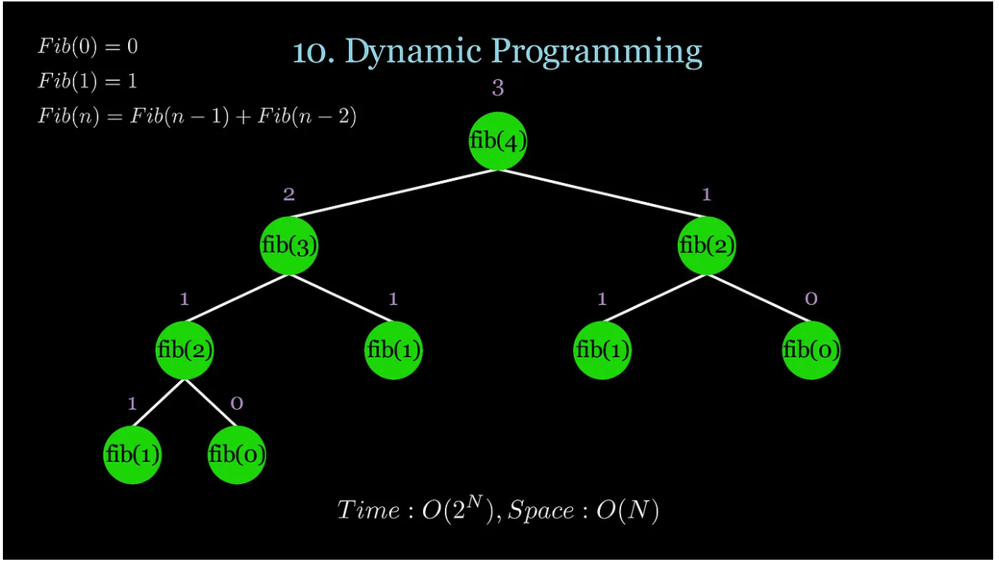

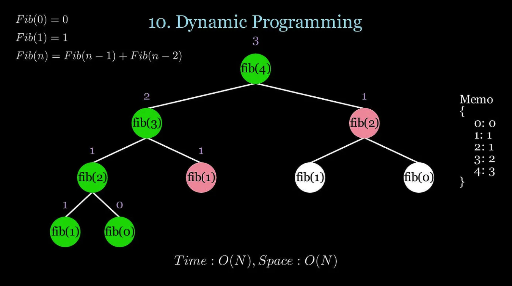

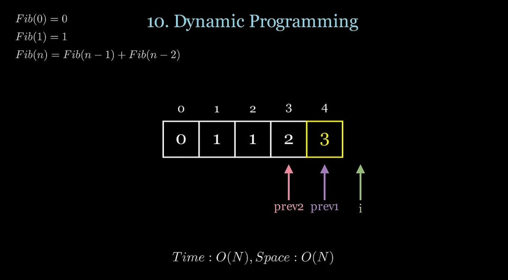

### Technique
Dynamic Programming is used when you need to solve a problem that depends on previous results from subproblems. You can effectively “cache” these previous result values when you calculate them for the first time to be re-used later. Dynamic Programming has 2 main techniques:

- **Top Down** — Recursion (DFS) with Memoization. Memoization is a fancy word for a hashmap that can cache the values previously calculated. In the top down approach you start with the global problem and the recursively split it into subproblems to then solve the global problem.
  
- **Bottom Up** — Iteratively performed by using an array/matrix to store previous values. In the bottom up approach we start with base cases and then build up to the global solution iteratively.
  
Many times bottom up is preferred since you can reduce the space complexity if you don’t need access to all subproblems and can store the last couple of subproblem results using variables.

**Use Case**:   
- Overlapping subproblems and optimal substructure
- Optimization problems (min/max distance, profit, etc.)
- Sequence problems (longest increasing subsequence)
- Combinatorial problems (number of ways to do something)
- Reduce time complexity from exponential to polynomial

**Benefit**: Reduces time complexity by memoizing results of subproblems, avoiding redundant computations.  

```cpp
#include <vector>
#include <unordered_map>

// Top-down recursive Fibonacci without memoization
// Time: O(2^n), Space: O(n) due to recursion stack
long long fib_top_down(int n) {
    if (n == 0) return 0;
    if (n == 1) return 1;
    return fib_top_down(n - 1) + fib_top_down(n - 2);
}

// Top-down recursive Fibonacci with memoization
// Time: O(n), Space: O(n) for memoization and recursion stack
long fib_top_down_memo(int n, std::unordered_map<int, long>& memo) {
    if (memo.find(n) != memo.end()) {
        return memo[n];
    }
    if (n == 0) return 0;
    if (n == 1) return 1;
    memo[n] = fib_top_down_memo(n - 1, memo) + fib_top_down_memo(n - 2, memo);
    return memo[n];
}

// Wrapper function to initialize memoization map
long fib_top_down_memo(int n) {
    std::unordered_map<int, long> memo;
    return fib_top_down_memo(n, memo);
}

// Bottom-up Fibonacci using an array
// Time: O(n), Space: O(n)
long fib_bottom_up_array(int n) {
    if (n == 0) return 0;
    if (n == 1) return 1;
    
    std::vector<long> dp(n + 1, 0);
    dp[1] = 1;
    for (int i = 2; i <= n; ++i) {
        dp[i] = dp[i - 1] + dp[i - 2];
    }
    return dp[n];
}

// Bottom-up Fibonacci using two variables
// Time: O(n), Space: O(1)
long long fib_bottom_up(int n) {
    if (n == 0) return 0;
    if (n == 1) return 1;
    
    long long prev2 = 0, prev1 = 1;
    for (int i = 2; i <= n; ++i) {
        long long fib = prev2 + prev1;
        prev2 = prev1;
        prev1 = fib;
    }
    return prev1;
}
```

**Example Problems**:  
- .5. Longest Palindromic Substring 
- .0/1 Knapsack (Not on LeetCode, but common in interviews)
- .70. Climbing Stairs
- .322. Coin Change
- .1143. Longest Common Subsequence
- .300. Longest Increasing Subsequence
- .72. Edit Distance

  
## Bit Manipulation
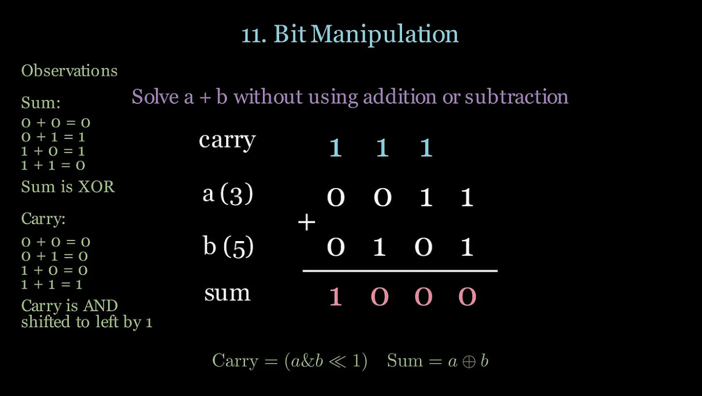

**Use Case**: Solve problems using binary operations, such as finding a single number in an array or counting bits.  

**Benefit**: Reduces space complexity by operating at the bit level, ideal for low-level optimizations.  

**Example Problems**:  
- Single Number (LeetCode #136)  
- Number of 1 Bits (LeetCode #191)  
- Reverse Bits (LeetCode #190)

```py
"""
Useful bitwise operators for LeetCode
"""
def binary_operators():
    return {
        "AND": a & b,
        "OR": a | b,
        "XOR": a ^ b,
        "NOT": ~a, # ~a = -a-1 in python
        "Left Shift (a << b)": a << b,  # left shift 'a' by 'b' bits
        "Right Shift (a >> b)": a >> b,  # right shift 'a' by 'b' bits
        "Mask": a & 1 # gives you the least significant bit of a
    }
```


## Overlapping Intervals
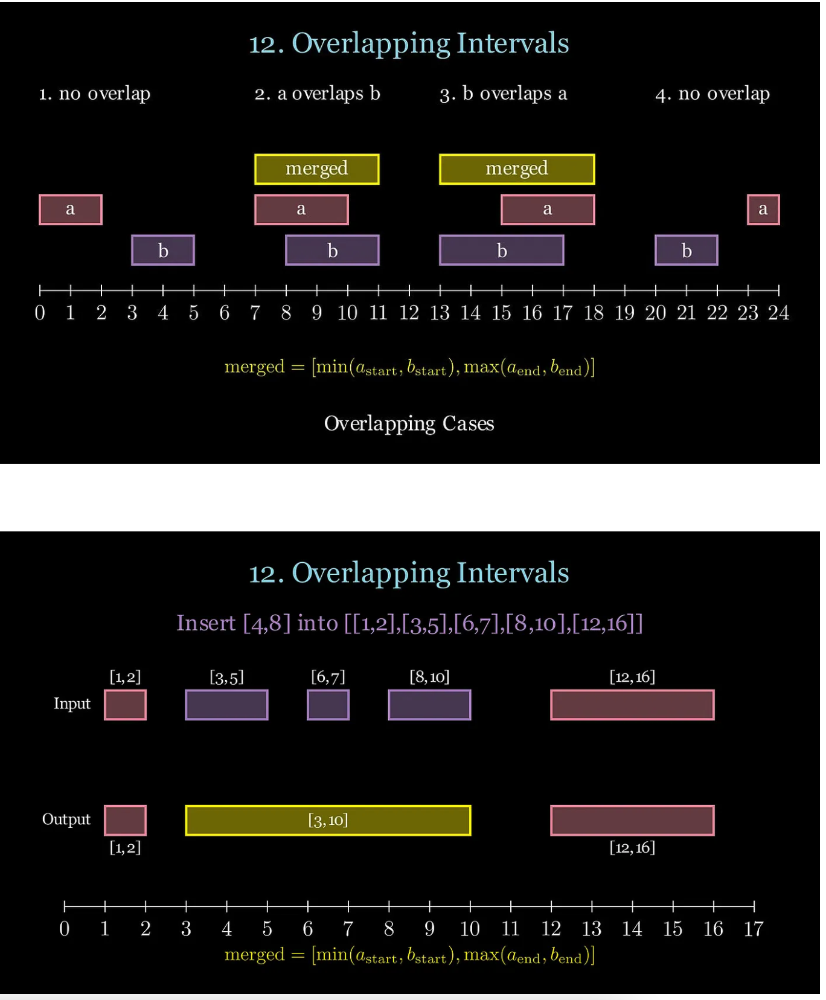

### When to use it?
- Merge or consolidate ranges
- Schedule or find conflicts (e.g. meeting rooms)
- Find gaps or missing intervals

Knowing how to merge overlapping intervals is crucial for these problems.

If a_end≥b_start:mergedInterval=[min(astart,bstart),max(aend,bend))

Usually, you will want to sort the input by the start times so you can guarantee order and always have “a” appear before “b”, making it easier to compare time ranges in chronological order. In the example above, we insert [4,8] into the array, but that eventually gets merged with [3,5], [6,7], and [8,10], into [3,10].

```py
"""
Generic template for interval problems
"""
def process_intervals(intervals):
    # Sort intervals by start time (common preprocessing step)
    intervals.sort(key=lambda x: x[0])
    
    # Example: Merged intervals (modify as needed for your problem)
    result = []
    for interval in intervals:
        # If result is empty or no overlap with the last interval in result
        if not result or result[-1][1] < interval[0]:
            result.append(interval)  # Add the interval as is
        else:
            # Merge overlapping intervals
            result[-1][1] = max(result[-1][1], interval[1])
    
    return result
```

```cpp
#include <vector>
#include <algorithm>

// Definition of an interval
struct Interval {
    int start;
    int end;
    Interval(int s, int e) : start(s), end(e) {}
};

std::vector<Interval> process_intervals(std::vector<Interval>& intervals) {
    // Handle empty input
    if (intervals.empty()) {
        return {};
    }

    // Sort intervals by start time
    std::sort(intervals.begin(), intervals.end(), 
              [](const Interval& a, const Interval& b) {
                  return a.start < b.start;
              });

    // example: merge overlapping intervals (modify as needed for your problem)
    std::vector<Interval> result;
    for (const Interval& interval : intervals) {
        // If result is empty or no overlap with the last interval in result
        if (result.empty() || result.back().end < interval.start) {
            result.push_back(interval); // Add the interval as is
        } else {
            // Merge overlapping intervals
            result.back().end = std::max(result.back().end, interval.end);
        }
    }

    return result;
}

int main() {
    std::vector<Interval> intervals = {
        Interval(1, 3),
        Interval(2, 6),
        Interval(8, 10),
        Interval(15, 18)
    };

    std::vector<Interval> result = process_intervals(intervals);

    std::cout << "Merged Intervals: ";
    for (const Interval& interval : result) {
        std::cout << "[" << interval.start << "," << interval.end << "] ";
    }
    std::cout << std::endl;

    return 0;
}

//Merged Intervals: [1,6] [8,10] [15,18]
```

### LeetCode Questions
- .57. Insert Interval
- .56. Merge Intervals
- .435. Non-overlapping Intervals
- .1834. Single-Threaded CPU


## Monotonic Stack
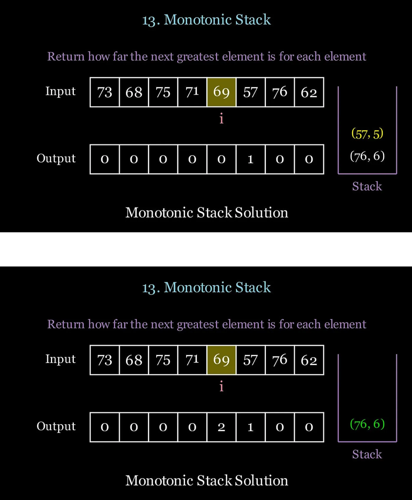
A monotonic stack is a stack where elements are maintained in either a strictly increasing or decreasing order. This order allows for efficient solutions to problems involving comparisons between elements, such as finding the next greater or smaller element in a sequence. 

### When to use it?
- Find Next Greater or Smaller Element
- Find left/right boundary points in histograms or rectangles
- Maintain elements in order to optimize operations

### Technique
If you want to find the next greater/smaller element for all elements in an array the brute force approach will take O(N²). However, with the use of a monotonic stack (either increasing or decreasing order, depending on the problem), we can achieve O(N) time by storing and keeping track of the greatest/smallest elements up until the current iteration. In the example above, notice that we popped 57 from the stack because 69 is greater than 57. However, 76 is greater than 69 so it is a valid solution and we update the output.

```py
"""
Monotonic increasing stack template.
"""
def monotonic_increasing_stack(arr):
    stack = [] 
    for i, num in enumerate(arr):
        # Modify condition based on the problem
        while stack and stack[-1][0] > num:
            stack.pop()

if stack:
            pass # process result from top of stack
        # Append current value and index
        stack.append((num,i))
"""
Monotonic decreasing stack template.
"""
def monotonic_decreasing_stack(arr):
    stack = []
    for i, num in enumerate(arr):
        # Modify condition based on the problem
        while stack and stack[-1][0] < num:
            stack.pop()
        if stack:
            pass # process result from top of stack
        # Append current value and index
        stack.append((num,i))
```

```cpp
#include <iostream>
#include <stack>
#include <vector>

using namespace std;

// Function to implement monotonic increasing stack
vector<int> monotonicIncreasing(vector<int>& nums)
{
    int n = nums.size();
    stack<int> st;
    vector<int> result;

    // Traverse the array
    for (int i = 0; i < n; ++i) {

        // While stack is not empty AND top of stack is more
        // than the current element
        while (!st.empty() && st.top() > nums[i]) {

            // Pop the top element from the
            // stack
            st.pop();
        }

        // Push the current element into the stack
        st.push(nums[i]);
    }

    // Construct the result array from the stack
    while (!st.empty()) {
        result.insert(result.begin(), st.top());
        st.pop();
    }

    return result;
}

int main() {
    // Example usage:
    vector<int> nums = {3, 1, 4, 1, 5, 9, 2, 6};
    vector<int> result = monotonicIncreasing(nums);
    cout << "Monotonic increasing stack: ";
    for (int num : result) {
        cout << num << " ";
    }
    cout << endl;

    return 0;
}

//Output: Monotonic increasing stack: 1 1 2 6 

// Function to implement monotonic decreasing stack
vector<int> monotonicDecreasing(vector<int>& nums) {
    int n = nums.size();
    stack<int> st;
    vector<int> result(n);

    // Traverse the array
    for (int i = 0; i < n; ++i) {
        // While stack is not empty AND top of stack is less than the current element
        while (!st.empty() && st.top() < nums[i]) {
            st.pop();
        }

        // Construct the result array
        if (!st.empty()) {
            result[i] = st.top();
        } else {
            result[i] = -1;
        }

        // Push the current element into the stack
        st.push(nums[i]);
    }

    return result;
}

int main() {
    vector<int> nums = {3, 1, 4, 1, 5, 9, 2, 6};
    vector<int> result = monotonicDecreasing(nums);

    cout << "Monotonic decreasing stack: ";
    for (int val : result) {
        cout << val << " ";
    }
    cout << endl;

    return 0;
}

//Output: Monotonic decreasing stack: -1 3 -1 4 -1 -1 9 9 
```
### LeetCode Questions
- .496. Next Greater Element I
- .503. Next Greater Element II
- .739. Daily Temperatures
- .84. Largest Rectangle in Histogram


## Monotonic deque
Here we introduce an interesting data structure. It's a deque with an interesting property - the elements in the deque from head to tail are in decreasing order (hence the name monotonic).

To achieve this property, we modify the push operation so that when we push an element into the deque, we first pop everything smaller than it out of the deque.
```cpp
// C++ code for the above approach:
#include <bits/stdc++.h>
using namespace std;

// Function to solve Increasing
// Monotonic queue
deque<int> increasing_monotonic_queue(int arr[], int n)
{

    deque<int> q;
    for (int i = 0; i < n; i++) {

        // If recently added element is
        // greater current element
        while (!q.empty() && q.back() > arr[i]) {

            q.pop_back();
        }

        q.push_back(arr[i]);
    }

    return q;
}

// Driver code
int main()
{

    int arr[] = { 1, 2, 3, 4, 5, 6 };
    int n = sizeof(arr) / sizeof(arr[0]);

    // Function call
    deque<int> q = increasing_monotonic_queue(arr, n);

    for (int i : q) {
        cout << i << " ";
    }
    return 0;
}
```

## Prefix Sum

### When to use it?
- Cumulative sums are needed from index 0 to any element
- Querying subarray sums frequently across multiple ranges
- Partial sums can be reused efficiently

To sum a subarray would take O(N). To sum Q subarrays would take O(N*Q). Can we perform a more efficient algorithm to answer queries? Yes, we can calculate a prefix sum array where
```bash
prefix[i]=prefix[i−1]+input[i]

And then we can find the sum of any subarray in O(1) time using the formula

sum[i:j]=prefix[j]−prefix[i−1]

Therefore, we can answer Q queries in O(N) time complexity with a prefix sum.
```

```c++
#include <vector>
using namespace std;

/**
 * Builds the prefix sum array
 */
vector<int> build_prefix_sum(const vector<int>& arr) {
    // Initialize prefix sum array
    int n = arr.size();
    vector<int> prefix(n);
    
    // First element is the same as the original array
    prefix[0] = arr[0];
    
    // Build the prefix sum array
    for (int i = 1; i < n; i++) {
        prefix[i] = prefix[i - 1] + arr[i];
    }
    
    return prefix;
}

/**
 * Queries the sum of elements in a subarray [left, right] using prefix sum.
 */
int query_subarray_sum(const vector<int>& prefix, int i, int j) {
    if (i == 0) {
        return prefix[j];
    }
    return prefix[j] - prefix[i - 1];
}
```

### LeetCode Questions
- .303. Range Sum Query — Immutable
- .523. Continuous Subarray Sum
- .560. Subarray Sum Equals K

## Union Find 
**aka Disjoint-Set data structure**

A Union-Find algorithm, also known as a Disjoint-Set data structure, is used to manage a collection of elements partitioned into disjoint (non-overlapping) subsets. It efficiently supports two primary operations:

- **Union**: Merge two subsets into a single subset.
- **Find**: Determine which subset a particular element belongs to, often by returning a representative (or "root") of that subset.

### Key Features
**Purpose**: Commonly used in problems involving grouping, such as detecting cycles in graphs (e.g., Kruskal's algorithm for minimum spanning trees), connected components in graphs, or network connectivity.
Efficiency: With optimizations like path compression and union by rank/size, the amortized time complexity for each operation is nearly constant, specifically O(α(n)), where α(n) is the inverse Ackermann function, which grows extremely slowly and is effectively constant for all practical values of n.

**How It Works**:
The algorithm maintains a forest of trees, where each tree represents a subset, and the root of the tree is the representative of that subset. The data structure tracks:

- A parent array (or similar structure) to represent the tree hierarchy.
- Optionally, a rank or size array for optimization.

**Core Operations**

**Find(x):**
- Returns the root (representative) of the subset containing element x.
- Traverses the parent pointers from x to the root.
- With path compression, all nodes in the path are updated to point directly to the root, flattening the tree for future operations.

**Union(x, y):**
- Merges the subsets containing elements x and y.
- Finds the roots of x and y using Find.
- Makes one root the parent of the other, often using union by rank (attach the shorter tree to the taller one) or union by size (attach the smaller subset to the larger one) to keep trees balanced.

**Connected(x, y) (optional):**
- Checks if x and y are in the same subset by comparing their roots (i.e., Find(x) == Find(y)).


**Applications**

**Graph Algorithms:**
- Finding connected components in an undirected graph.
- Detecting cycles in Kruskal's algorithm for minimum spanning trees.
  
**Network Connectivity:** Determining if nodes in a network are connected.

**Image Processing:** Grouping pixels into regions (e.g., connected component labeling).

**Dynamic Equivalence:** Managing equivalence relations in a dynamic setting.- 

**Example Problems**:  
- Number of Provinces (LeetCode #547)  
- Redundant Connection (LeetCode #684)  
- Graph Valid Tree (LeetCode #261)

```c++
#include <vector>

class UnionFind {
private:
    std::vector<int> parent;
    std::vector<int> rank;

public:
    UnionFind(int n) {
        parent.resize(n);
        rank.resize(n, 0);
        for (int i = 0; i < n; ++i) {
            parent[i] = i; // Each element starts as its own parent
        }
    }

    int find(int x) {
        // Path compression: Make all nodes in path point to root
        if (parent[x] != x) {
            parent[x] = find(parent[x]);
        }
        return parent[x];
    }

    void unionSets(int x, int y) {
        // Union by rank: Attach shorter tree to root of taller tree
        int px = find(x);
        int py = find(y);
        if (px == py) return;
        if (rank[px] < rank[py]) {
            parent[px] = py;
        } else if (rank[px] > rank[py]) {
            parent[py] = px;
        } else {
            parent[py] = px;
            rank[px]++;
        }
    }

    bool connected(int x, int y) {
        return find(x) == find(y);
    }
};
```

### Graph valid Tree:
You have a graph of n nodes labeled from 0 to n - 1. You are given an integer n and a list of edges where edges[i] = [ai, bi] indicates that there is an undirected edge between nodes ai and bi in the graph.

Return true if the edges of the given graph make up a valid tree, and false otherwise.
```text
    0
 /  |  \
1   2   3
|
4
Input: n = 5, edges = [[0,1],[0,2],[0,3],[1,4]]
Output: true

    0
    |
    1 - 4
    | \
    2 - 3

Input: n = 5, edges = [[0,1],[1,2],[2,3],[1,3],[1,4]]
Output: false
```

```cpp
class Solution {
public:
    vector<int> p;

    bool validTree(int n, vector<vector<int>>& edges) {
        p.resize(n);
        for (int i = 0; i < n; ++i) p[i] = i;
        for (auto& e : edges) {
            int a = e[0], b = e[1];
            if (find(a) == find(b)) return 0;
            p[find(a)] = find(b);
            --n;
        }
        return n == 1;
    }

    int find(int x) {
        if (p[x] != x) p[x] = find(p[x]);
        return p[x];
    }
};
```

## Trie
A Trie (pronounced "try"), also known as a prefix tree, is a tree-like data structure used to efficiently store and retrieve a dynamic set of strings, typically over a fixed alphabet (e.g., lowercase letters, digits). It is particularly useful for problems involving prefix-based searches, such as autocomplete, dictionary lookups, or IP routing tables. 

Structure: A tree where each node represents a single character of a string, and paths from the root to leaf (or marked nodes) represent complete strings.

**Use Case**: Handle string prefix-based problems, such as implementing autocomplete or searching a dictionary.  

**Benefit**: Efficiently stores and retrieves strings with common prefixes, reducing time complexity for prefix searches.  

**How It Works:**
Nodes: Each node contains:

- An array or map of pointers to child nodes, one for each possible character in the alphabet (e.g., 26 for lowercase letters).
- A boolean flag (often called isEndOfWord) to mark whether the node represents the end of a valid string.
- Root: The trie starts with an empty root node.
- Edges: Represent characters, forming paths that correspond to strings or prefixes.
```text
For strings "cat", "car", "cap":

       (root)
      /   |   \
     c    a    p
    /     |     \
   a      r      (end)
  / \     |
 t   p   (end)
(end)(end)
```

**Applications**
- Autocomplete: Suggest words based on a prefix (e.g., Google search).
- Spell Checkers: Store a dictionary for quick lookups.
- IP Routing: Store IP prefixes for longest prefix matching.
- Word Games: Efficiently find valid words or prefixes (e.g., Boggle).
- Pattern Matching: Used in algorithms like Aho-Corasick for multiple pattern searches.

```c++
#include <vector>

struct TrieNode {
    std::vector<TrieNode*> children;
    bool isEndOfWord;
    TrieNode() : children(26, nullptr), isEndOfWord(false) {} // For lowercase letters
};

class Trie {
private:
    TrieNode* root;

public:
    Trie() { root = new TrieNode(); }

    void insert(const std::string& word) {
        TrieNode* node = root;
        for (char c : word) {
            int index = c - 'a'; // Assuming lowercase letters
            if (!node->children[index]) {
                node->children[index] = new TrieNode();
            }
            node = node->children[index];
        }
        node->isEndOfWord = true;
    }

    bool search(const std::string& word) {
        TrieNode* node = root;
        for (char c : word) {
            int index = c - 'a';
            if (!node->children[index]) return false;
            node = node->children[index];
        }
        return node->isEndOfWord;
    }

    bool startsWith(const std::string& prefix) {
        TrieNode* node = root;
        for (char c : prefix) {
            int index = c - 'a';
            if (!node->children[index]) return false;
            node = node->children[index];
        }
        return true;
    }
};

Trie trie;
trie.insert("cat");
trie.insert("car");
trie.search("cat");      // Returns true
trie.search("cab");      // Returns false
trie.startsWith("ca");   // Returns true
```

**Example Problems**:  
- Implement Trie (Prefix Tree) (LeetCode #208)  
- Word Search II (LeetCode #212)  
- Add and Search Word (LeetCode #211)

### 211. Design Add and Search Words Data Structure
https://leetcode.com/problems/design-add-and-search-words-data-structure/description/

```c++
struct TrieNode {
    unordered_map<char, TrieNode*> children;
    bool word = false;
};

class WordDictionary {
    TrieNode* trie;
public:
    WordDictionary() {
       trie = new TrieNode(); 
    }
    
    /** Returns if the word is in the node. */
    bool searchInNode(string word, TrieNode* node) {
        for (int i = 0; i < word.length(); ++i) {
            char ch = word[i];
            if (!node->children.count(ch)) {
                // If the current character is '.'
                // check all possible nodes at this level
                if (ch == '.') {
                    for (auto x : node->children) {
                        TrieNode* child = x.second;
                        if (searchInNode(word.substr(i + 1), child)) {
                            return true;
                        }
                    }
                }
                // If no nodes lead to answer
                // or the current character != '.'
                return false;
            } else {
                // If the character is found
                // go down to the next level in trie
                node = node->children[ch];
            }
        }
        return node->word;
    }

    void addWord(string word) {
        TrieNode* node = trie;

        for (char ch : word) {
            if (node->children.count(ch) == 0) { //first char not found
                node->children[ch] = new TrieNode();
            }
            node = node->children[ch];
        }

        node->word = true;
    }
    
    bool search(string word) {
        return searchInNode(word, trie);
    }
};

/**
 * Your WordDictionary object will be instantiated and called as such:
 * WordDictionary* obj = new WordDictionary();
 * obj->addWord(word);
 * bool param_2 = obj->search(word);
 */
```


## Greedy
**Use Case**: Make locally optimal choices to achieve a global optimum, such as selecting activities or solving jump games.  

Greedy algorithms are a class of algorithms that make locally optimal choices at each step with the hope of finding a global optimum solution.

- At every step of the algorithm, we make a choice that looks the best at the moment. To make the choice, we sometimes sort the array so that we can always get the next optimal choice quickly. We sometimes also use a priority queue to get the next optimal item.
- After making a choice, we check for constraints (if there are any) and keep picking until we find the solution.
- Greedy algorithms do not always give the best solution. For example, in coin change and 0/1 knapsack problems, we get the best solution using Dynamic Programming.
- Examples of popular algorithms where Greedy gives the best solution are Fractional Knapsack, Dijkstra's algorithm, Kruskal's algorithm, Huffman coding and Prim's Algorithm

**Benefit**: Simplifies problems by avoiding exhaustive searches, often leading to efficient solutions.  

**Example Problems**:  
- Jump Game (LeetCode #55)  
- Best Time to Buy and Sell Stock II (LeetCode #122)  
- Minimum Number of Arrows to Burst Balloons (LeetCode #452)


## References
- Original Article: ["14 LeetCode Patterns to Solve Any Question"](https://medium.com/@shubhamkumarcode/14-leetcode-patterns-to-solve-any-question-1dcdcc650bfa)
- LeetCode Platform: [leetcode.com](https://leetcode.com)
