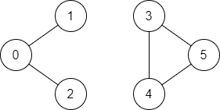

```bash
# 56. Merge Intervals
# 253. Meeting Rooms II
# 210. Course Schedule II - Depth-First Search - Breadth-First Search, Graph, Topological Sort
# 1971. Find if Path Exists in Graph - Depth-First Search, Breadth-First Search, Union Find, Graph
# 797. All Paths From Source to Target - Backtracking, Depth-First Search, Breadth-First Search, Graph
# 133. Clone Graph Solution
```

# 56. Merge Intervals

## Problem Description
Given an array of intervals where `intervals[i] = [start_i, end_i]`, merge all overlapping intervals and return an array of the non-overlapping intervals that cover all the intervals in the input.

### Example
```
Input: intervals = [[1,3],[2,6],[8,10],[15,18]]
Output: [[1,6],[8,10],[15,18]]
Explanation: Intervals [1,3] and [2,6] overlap, so they are merged into [1,6].

Input: intervals = [[1,4],[4,5]]
Output: [[1,5]]
Explanation: Intervals [1,4] and [4,5] touch at 4, so they are merged into [1,5].

Input: intervals = [[1,4],[0,4]]
Output: [[0,4]]
Explanation: Intervals [0,4] and [1,4] overlap, so they are merged into [0,4].
```

### Constraints
- `1 <= intervals.length <= 10^4`
- `intervals[i].length == 2`
- `0 <= start_i <= end_i <= 10^4`

## Solution Approach
The problem can be solved by sorting the intervals by start time and then merging overlapping intervals in a single pass.

### Sort and Merge Approach
1. Sort the intervals based on their start times.
2. Initialize a result array with the first interval.
3. Iterate through the sorted intervals starting from the second interval:
   - If the current interval overlaps with the last interval in the result (i.e., `start_i <= end_last`), merge them by updating the end time of the last interval to the maximum of their end times.
   - Otherwise, add the current interval to the result as a new non-overlapping interval.
4. Return the result array.

### Example Implementation (C++)
```cpp
class Solution {
public:
    vector<vector<int>> merge(vector<vector<int>>& intervals) {
        vector<vector<int>> ans;
        int start = INT_MAX;
        int end = INT_MIN;
        sort(intervals.begin(), intervals.end());
        for(int i=0; i < intervals.size(); i++) {
            start = min(start, intervals[i][0]);
            end = max(end, intervals[i][1]);
            
            if(i == intervals.size()-1 || end < intervals[i+1][0]) {
                ans.push_back(vector<int>({start, end}));
                start = INT_MAX;
                end = INT_MIN;
            }                
        }
        
        return ans;
    }
};
```

```cpp
class Solution {
public:
    vector<vector<int>> merge(vector<vector<int>>& intervals) {
        // Sort intervals by start time
        sort(intervals.begin(), intervals.end());
        
        vector<vector<int>> result;
        result.push_back(intervals[0]);
        
        for (int i = 1; i < intervals.size(); i++) {
            if (intervals[i][0] <= result.back()[1]) {
                // Overlap: Merge by updating the end time
                result.back()[1] = max(result.back()[1], intervals[i][1]);
            } else {
                // No overlap: Add new interval
                result.push_back(intervals[i]);
            }
        }
        
        return result;
    }
};
```

### How It Works
- **Sorting**:
  - Sort intervals by start time to ensure we process them in order, making it easier to detect overlaps.
- **Merging**:
  - Start with the first interval in the result.
  - For each subsequent interval, check if its start time is less than or equal to the end time of the last interval in the result.
  - If overlapping, update the end time to the maximum of the two end times.
  - If not overlapping, append the interval to the result.
- **Edge Cases**:
  - Single interval: Returned as is.
  - Non-overlapping intervals: Each added to the result.
  - All overlapping: Merged into one interval.
  - Touching intervals (e.g., `[1,4],[4,5]`): Considered overlapping and merged.
- **Result**: Returns the array of merged, non-overlapping intervals.

### Time and Space Complexity
- **Time Complexity**: O(n log n), where `n` is the number of intervals, due to the sorting step. The merging step is O(n).
- **Space Complexity**: O(n) for the output array. If sorting in-place is not considered, additional O(log n) space may be used by the sorting algorithm.

### Alternative Approach
1. **Sweep Line**:
   - Treat start and end times as events (+1 for start, -1 for end) and sort them.
   - Scan events to track active intervals and construct merged intervals.
   - Time Complexity: O(n log n)
   - Space Complexity: O(n)
The sort and merge approach is preferred for its simplicity and direct handling of intervals without needing to process events separately.


# 253. Meeting Rooms II

This document describes the solution to the "Meeting Rooms II" problem (LeetCode #253).

## Problem Description
Given an array of meeting time intervals `intervals` where `intervals[i] = [start_i, end_i]`, return the minimum number of conference rooms required to accommodate all meetings without conflicts.

### Example
```
Input: intervals = [[0,30],[5,10],[15,20]]
Output: 2
Explanation: Two rooms are needed as [5,10] and [15,20] overlap with [0,30].

Input: intervals = [[7,10],[2,4]]
Output: 1
Explanation: No overlap, so only one room is needed.
```

### Constraints
- `1 <= intervals.length <= 10^4`
- `0 <= start_i < end_i <= 10^6`

## Solution Approach
The problem can be solved efficiently using a chronological ordering approach by separating start and end times, sorting them, and tracking the maximum number of overlapping meetings.

### Chronological Ordering Approach
1. Create two arrays: one for start times and one for end times.
2. Sort both arrays independently.
3. Use two pointers to scan the sorted arrays:
   - Increment a counter when encountering a start time (new meeting begins).
   - Decrement the counter when encountering an end time (meeting ends).
   - Track the maximum value of the counter, which represents the maximum number of simultaneous meetings.
4. Return the maximum counter value as the number of rooms needed.

### Example Implementation (C++)
```cpp
class Solution {
public:
    int minMeetingRooms(vector<vector<int>>& intervals) {
        sort(intervals.begin(), intervals.end());
        
        int rooms = 0;
        priority_queue<int, vector<int>, std::greater<int>> q;
        for(int i = 0; i < intervals.size(); i++)
        {
            vector<int> m = intervals[i];
            if(q.empty()) {
                q.push(m[1]);
                rooms++;
                continue;
            }
            
            int top = q.top();
            if(top <= m[0]) {
                q.pop();
                q.push(m[1]);
            }
            else
            {
                rooms++;
                q.push(m[1]);
            }        
        }
        
        return rooms;
    }
};
```

```cpp
class Solution {
public:
    int minMeetingRooms(vector<vector<int>>& intervals) {
        vector<int> startTimes, endTimes;
        for (const auto& interval : intervals) {
            startTimes.push_back(interval[0]);
            endTimes.push_back(interval[1]);
        }
        
        sort(startTimes.begin(), startTimes.end());
        sort(endTimes.begin(), endTimes.end());
        
        int maxRooms = 0, currentRooms = 0;
        int start = 0, end = 0;
        
        while (start < startTimes.size()) {
            if (startTimes[start] < endTimes[end]) {
                currentRooms++;
                maxRooms = max(maxRooms, currentRooms);
                start++;
            } else {
                currentRooms--;
                end++;
            }
        }
        
        return maxRooms;
    }
};
```

### How It Works
- **Separate Times**:
  - Extract start and end times into separate arrays.
- **Sorting**:
  - Sort start times and end times to process events chronologically.
- **Two Pointers**:
  - Compare the next start time with the next end time.
  - If the start time is earlier, a new meeting begins (`currentRooms++`).
  - If the end time is earlier or equal, a meeting ends (`currentRooms--`).
  - Update `maxRooms` to track the peak number of simultaneous meetings.
- **Edge Cases**:
  - Single interval: Requires one room.
  - Non-overlapping intervals: Requires one room.
  - All overlapping intervals: Requires as many rooms as intervals.
- **Result**: The maximum number of rooms needed is the peak value of `currentRooms`.

### Time and Space Complexity
- **Time Complexity**: O(n log n), where `n` is the number of intervals, due to sorting the start and end times.
- **Space Complexity**: O(n), for storing the start and end times arrays.

### Alternative Approach
1. **Priority Queue (Min Heap)**:
   - Sort intervals by start time.
   - Use a min heap to track end times of active meetings.
   - For each interval, remove ended meetings (end time <= current start time) and add the new meeting’s end time.
   - Track the maximum size of the heap.
   - Time Complexity: O(n log n) for sorting and heap operations
   - Space Complexity: O(n) for the heap
The chronological ordering approach is preferred for its simplicity and clarity, avoiding the need for a heap while maintaining the same time complexity.


# 210. Course Schedule II - Depth-First Search - Breadth-First Search, Graph, Topological Sort

## Problem Description
There are a total of `numCourses` courses labeled from `0` to `numCourses - 1`. You are given an array `prerequisites` where `prerequisites[i] = [a_i, b_i]` indicates that you must take course `b_i` first before taking course `a_i`. Return the ordering of courses you should take to finish all courses. If there are multiple valid orderings, return any one. If it is impossible to finish all courses, return an empty array.

### Example
```
Input: numCourses = 2, prerequisites = [[1,0]]
Output: [0,1]
Explanation: Take course 0 first, then course 1.

Input: numCourses = 4, prerequisites = [[1,0],[2,0],[3,1],[3,2]]
Output: [0,2,1,3]
Explanation: One valid order is to take course 0, then 2, then 1, then 3.

Input: numCourses = 1, prerequisites = []
Output: [0]
Explanation: No prerequisites, so take course 0.

Input: numCourses = 2, prerequisites = [[1,0],[0,1]]
Output: []
Explanation: A cycle exists, so it’s impossible to take all courses.
```

### Constraints
- `1 <= numCourses <= 2000`
- `0 <= prerequisites.length <= numCourses * (numCourses - 1)`
- `prerequisites[i].length == 2`
- `0 <= a_i, b_i < numCourses`
- All pairs `[a_i, b_i]` are distinct.

## Solution Approach
The problem can be solved using a topological sort with depth-first search (DFS) to detect cycles and determine a valid course order. The prerequisites form a directed graph where an edge from `b_i` to `a_i` means `b_i` must be taken before `a_i`.

### Topological Sort with DFS Approach
1. Build an adjacency list representation of the graph from the prerequisites.
2. Use DFS to perform a topological sort:
   - For each unvisited course, explore its prerequisites recursively.
   - Track visited nodes and nodes in the current recursion stack to detect cycles.
   - If a cycle is detected (a node is revisited in the current stack), return an empty array.
   - After exploring all prerequisites of a course, add it to the result.
3. Reverse the result to get the correct order (since DFS adds nodes post-exploration).
4. Return the result if all courses are included; otherwise, return an empty array.

### Example Implementation (C++)
```cpp
class Solution {
public:    
    vector<int> findOrder(int numCourses, vector<vector<int>>& prerequisites) {
        //Input: numCourses = 4, prerequisites = [[1,0],[2,0],[3,1],[3,2]]
        //build adj list
        vector<int> courses(numCourses,0);
        vector<int> courseList;
        queue<int> q;

        if(prerequisites.size() == 0) {
            for(int i = 0; i < numCourses; i++)
                courseList.push_back(i);
            
            return courseList;
        }

        vector<vector<int>> adj_list(numCourses, vector<int>());
        for(auto v : prerequisites) {
            cout << v[1]<<" "<<v[0]<<endl;
            adj_list[v[1]].push_back(v[0]);   
            ++courses[v[0]];
        }
        
        for(int i = 0; i < numCourses; i++) {
            if(courses[i] == 0)
                q.push(i);
        }
        
        while(!q.empty())
        {
            int node = q.front();
            q.pop();
            courseList.push_back(node);
            
            auto depends = adj_list[node];
            for(auto course : depends) {
                --courses[course]; //decrement the dependency
                if(courses[course] == 0)
                    q.push(course);
            }
        }
        
        return courseList.size() == numCourses ? courseList : vector<int>(); //cyclical
    }
};
```

```cpp
class Solution {
public:
    vector<int> findOrder(int numCourses, vector<vector<int>>& prerequisites) {
        // Build adjacency list
        vector<vector<int>> graph(numCourses);
        for (const auto& prereq : prerequisites) {
            graph[prereq[1]].push_back(prereq[0]);
        }
        
        vector<int> result;
        vector<bool> visited(numCourses, false);
        vector<bool> recStack(numCourses, false);
        
        // Perform DFS for each unvisited course
        for (int i = 0; i < numCourses; i++) {
            if (!visited[i]) {
                if (!dfs(i, graph, visited, recStack, result)) {
                    return {}; // Cycle detected
                }
            }
        }
        
        // Reverse the result to get correct order
        reverse(result.begin(), result.end());
        return result;
    }
    
private:
    bool dfs(int course, vector<vector<int>>& graph, vector<bool>& visited, 
             vector<bool>& recStack, vector<int>& result) {
        visited[course] = true;
        recStack[course] = true;
        
        // Explore all prerequisites
        for (int nextCourse : graph[course]) {
            if (!visited[nextCourse]) {
                if (!dfs(nextCourse, graph, visited, recStack, result)) {
                    return false; // Cycle detected
                }
            } else if (recStack[nextCourse]) {
                return false; // Cycle detected
            }
        }
        
        recStack[course] = false;
        result.push_back(course);
        return true;
    }
};
```

### How It Works
- **Graph Construction**:
  - Create an adjacency list where `graph[b_i]` includes `a_i` for each prerequisite `[a_i, b_i]`.
- **DFS**:
  - For each course, mark it as visited and add it to the recursion stack.
  - Recursively explore its prerequisites.
  - If a prerequisite is in the recursion stack, a cycle exists, so return an empty array.
  - After exploring all prerequisites, add the course to the result.
- **Cycle Detection**:
  - The `recStack` tracks nodes in the current DFS path. A node revisited in `recStack` indicates a cycle.
- **Result**:
  - Reverse the result to get a valid topological order (courses with no prerequisites come first).
  - If a cycle exists, return an empty array.
- **Edge Cases**:
  - No prerequisites: Return `[0, 1, ..., numCourses-1]`.
  - Single course: Return `[0]`.
  - Disconnected components: DFS from each unvisited course ensures all are processed.
- **Result**: Returns a valid course order or an empty array if impossible.

### Time and Space Complexity
- **Time Complexity**: O(V + E), where `V` is `numCourses` and `E` is the number of prerequisites. Building the graph is O(E), and DFS visits each node and edge once.
- **Space Complexity**: O(V + E) for the adjacency list, plus O(V) for the visited and recursion stack arrays, and O(V) for the output.

### Alternative Approach
1. **Kahn’s Algorithm (BFS)**:
   - Build the graph and compute in-degrees for each course.
   - Start with courses having no prerequisites (in-degree 0) and use a queue to process them.
   - Reduce in-degrees of dependent courses and add them to the queue when their in-degree becomes 0.
   - If all courses are processed, return the order; otherwise, a cycle exists.
   - Time Complexity: O(V + E)
   - Space Complexity: O(V + E)
The DFS approach is chosen for its clarity in cycle detection and straightforward implementation, but Kahn’s algorithm is equally valid and may be preferred for iterative solutions.


# 1971. Find if Path Exists in Graph - Depth-First Search, Breadth-First Search, Union Find, Graph

## Problem Description
You are given an undirected graph with `n` nodes labeled from `0` to `n-1` and a list of undirected edges (each edge is a pair of nodes). Write a function to check whether there is a valid path from node `source` to node `destination` in the graph. A valid path is a sequence of nodes where each consecutive pair is connected by an edge.

### Example
```
Input: n = 3, edges = [[0,1],[1,2],[2,0]], source = 0, destination = 2
Output: true
Explanation: There is a path 0 -> 1 -> 2 or 0 -> 2.
```


```
Input: n = 6, edges = [[0,1],[0,2],[3,5],[5,4],[4,3]], source = 0, destination = 5
Output: false
Explanation: No path exists from 0 to 5 as the graph is disconnected.
```



### Constraints
- `1 <= n <= 2 * 10^5`
- `0 <= edges.length <= 2 * 10^5`
- `edges[i].length == 2`
- `0 <= u_i, v_i <= n - 1`
- `u_i != v_i`
- `0 <= source, destination <= n - 1`
- There are no parallel edges or self-loops.

## Solution Approach
The problem can be solved using a depth-first search (DFS) to explore all possible paths from the `source` to the `destination` in the undirected graph.

### DFS Approach
1. Build an adjacency list representation of the undirected graph from the edges.
2. Use DFS to explore paths starting from the `source` node:
   - Mark visited nodes to avoid cycles.
   - Recursively visit all unvisited neighbors of the current node.
   - Return `true` if the `destination` node is reached.
3. Return `false` if no path is found after exploring all possibilities.

### Example Implementation (C++)
```cpp
class Solution {
public:
        
    bool dfs(vector<vector<int>>& adjacency_list, vector<bool>& visited, int current, int end) {
        if(current == end)
            return true;
        
        if(visited[current])
            return false;
        
        visited[current] = 1;
        
        for(auto neighbor : adjacency_list[current])
            if(dfs(adjacency_list, visited, neighbor, end))
                return true;
                
        return false;
    }
    
    bool validPath(int n, vector<vector<int>>& edges, int start, int end) {
        vector<vector<int>> adjacency_list(n);
        
        //build an adjacency list of each vertex
        for (vector<int> edge : edges) {
            adjacency_list[edge[0]].push_back(edge[1]);
            adjacency_list[edge[1]].push_back(edge[0]);
        }
        
        vector<bool> seen(n); //tells if a vertex is visited or not
        
        //Below is DFS using recusrion
        //return dfs(adjacency_list, seen, start, end);
        
        //BFS method using queue
        queue<int> q;
        q.push(start);
        while(!q.empty())
        {
            int node = q.front();
            q.pop();
            
            if(node == end)
                return true;
            
            if(seen[node]) //dont add its kids
                continue;
            
            seen[node] = true;
            
            for(auto neighbor : adjacency_list[node])
                q.push(neighbor);
        }
        
        return false;
        
        /*
        //DFS method using stack
        stack<int> st;
        st.push(start);
        
        while (!st.empty()) {
            // Get the current node.
            int node = st.top();
            st.pop();
            
            // Check if we have reached the target node.
            if (node == end) {
                return true;
            }
            
            // Check if we've already visited this node.
            if (seen[node]) {
                continue;
            }
            seen[node] = true;
            
            // Add all neighbors to the stack.
            for (int neighbor : adjacency_list[node]) {
                st.push(neighbor);
            }
        }
        
        return false;
        */
    }
};
```

```cpp
class Solution {
public:
    bool validPath(int n, vector<vector<int>>& edges, int source, int destination) {
        // Build adjacency list
        vector<vector<int>> graph(n);
        for (const auto& edge : edges) {
            graph[edge[0]].push_back(edge[1]);
            graph[edge[1]].push_back(edge[0]); // Undirected graph
        }
        
        // Initialize visited array
        vector<bool> visited(n, false);
        
        // Perform DFS
        return dfs(source, destination, graph, visited);
    }
    
private:
    bool dfs(int current, int destination, vector<vector<int>>& graph, vector<bool>& visited) {
        // If destination is reached
        if (current == destination) {
            return true;
        }
        
        // Mark current node as visited
        visited[current] = true;
        
        // Explore all neighbors
        for (int neighbor : graph[current]) {
            if (!visited[neighbor]) {
                if (dfs(neighbor, destination, graph, visited)) {
                    return true;
                }
            }
        }
        
        return false;
    }
};
```

### How It Works
- **Graph Construction**:
  - Create an adjacency list where `graph[u]` includes `v` and `graph[v]` includes `u` for each edge `[u, v]`.
- **DFS**:
  - Start from the `source` node and mark it as visited.
  - Recursively explore each unvisited neighbor.
  - Return `true` if the `destination` is reached.
  - Return `false` if all paths from the current node are exhausted without reaching the destination.
- **Visited Array**:
  - Prevents revisiting nodes, avoiding infinite loops in cycles.
- **Edge Cases**:
  - `n = 1`: If `source == destination`, return `true` (no edges needed).
  - No edges: Only returns `true` if `source == destination`.
  - Disconnected graph: Returns `false` if no path exists.
- **Result**: Returns `true` if a path exists from `source` to `destination`, `false` otherwise.

### Time and Space Complexity
- **Time Complexity**: O(V + E), where `V` is the number of nodes (`n`) and `E` is the number of edges. Building the graph takes O(E), and DFS visits each node and edge at most once.
- **Space Complexity**: O(V + E) for the adjacency list, plus O(V) for the visited array and recursion stack, totaling O(V + E).

### Alternative Approach
1. **BFS (Breadth-First Search)**:
   - Use a queue to explore nodes level by level starting from `source`.
   - Mark visited nodes and enqueue unvisited neighbors.
   - Return `true` if `destination` is reached, `false` if the queue empties.
   - Time Complexity: O(V + E)
   - Space Complexity: O(V + E)
The DFS approach is chosen for its simplicity and recursive elegance, but BFS is equally valid and may be preferred for finding the shortest path in an unweighted graph.


# 797. All Paths From Source to Target - Backtracking, Depth-First Search, Breadth-First Search, Graph

This document describes the solution to the "All Paths From Source to Target" problem (LeetCode #797).

## Problem Description
Given a directed acyclic graph (DAG) of `n` nodes labeled from `0` to `n-1`, find all possible paths from node `0` to node `n-1` and return them in any order. The graph is given as an adjacency list `graph`, where `graph[i]` is a list of nodes that node `i` has directed edges to.

### Example
```
Input: graph = [[1,2],[3],[3],[]]
Output: [[0,1,3],[0,2,3]]
Explanation: The graph has 4 nodes. Paths from node 0 to node 3 are:
- 0 -> 1 -> 3
- 0 -> 2 -> 3
```


```
Input: graph = [[4,3,1],[3,2,4],[3],[4],[]]
Output: [[0,4],[0,3,4],[0,1,3,4],[0,1,2,3,4],[0,1,4]]
Explanation: All paths from node 0 to node 4 are listed.

Input: graph = [[1],[]]
Output: [[0,1]]
Explanation: Only one path from node 0 to node 1.
```


### Constraints
- `n == graph.length`
- `2 <= n <= 15`
- `0 <= graph[i][j] < n`
- `graph[i][j] != i` (no self-loops)
- All elements in `graph[i]` are unique.
- The graph is a directed acyclic graph (DAG).

## Solution Approach
The problem can be solved using a breadth-first search (BFS) to explore all possible paths from the source node (0) to the target node (n-1) in the DAG, tracking the path for each node explored.

### BFS with Path Tracking Approach
1. Use a queue to perform BFS, where each element is a pair of the current node and the path taken to reach it.
2. Initialize the queue with node 0 and its path `[0]`.
3. While the queue is not empty:
   - Dequeue the current node and its path.
   - If the current node is the target (n-1), add the path to the result.
   - For each neighbor of the current node, create a new path by appending the neighbor and enqueue it.
4. Return the list of all valid paths.

### Example Implementation (C++)
```cpp
class Solution {
public:
    vector<vector<int>> allPathsSourceTarget(vector<vector<int>>& graph) { //BFS SOlutuion
        vector<vector<int>> result;
        int n = graph.size();
        queue<pair<int, vector<int>>> q;
        
        // Start with node 0 and its path
        q.push({0, {0}});
        
        while (!q.empty()) {
            auto [current, path] = q.front();
            q.pop();
            
            // If target node is reached, add path to result
            if (current == n - 1) {
                result.push_back(path);
                continue;
            }
            
            // Explore all neighbors
            for (int next : graph[current]) {
                vector<int> newPath = path;
                newPath.push_back(next);
                q.push({next, newPath});
            }
        }
        
        return result;
    }
};

class Solution {
public:
    // DFS
    void dfs(vector<vector<int>>& graph, int node, vector<int>& path,
             vector<vector<int>>& paths) {
        
        path.push_back(node);
        if (node == graph.size() - 1) {
            paths.push_back(path);
            return;
        }
        vector<int> nextNodes = graph[node];
        for (int nextNode : nextNodes) {
            dfs(graph, nextNode, path, paths);
            path.pop_back();
        }
    }

    vector<vector<int>> allPathsSourceTarget(vector<vector<int>>& graph) {
        //the graph is basically an adj list where each index points to the direction to nodes
        //graph = [[1,2],[3],[3],[]]
        //-----------0,   1,  2,  3  <-- from 3 no direction is going out
        //since this is a directed graph we dont need visited or seen tracking as same node wont be
        //visited again
        
        vector<vector<int>> paths;
        if (graph.size() == 0) {
            return paths;
        }
        vector<int> path;
        dfs(graph, 0, path, paths);
        return paths;
    }
};

//DFS with backtracking
class Solution {
public:
    vector<vector<int>> allPathsSourceTarget(vector<vector<int>>& graph) {
        vector<vector<int>> result;
        vector<int> path = {0}; // Start with node 0
        dfs(0, graph.size() - 1, graph, path, result);
        return result;
    }
    
private:
    void dfs(int current, int target, vector<vector<int>>& graph, 
             vector<int>& path, vector<vector<int>>& result) {
        // If target node is reached, add path to result
        if (current == target) {
            result.push_back(path);
            return;
        }
        
        // Explore all neighbors
        for (int next : graph[current]) {
            path.push_back(next);
            dfs(next, target, graph, path, result);
            path.pop_back(); // Backtrack
        }
    }
};
```

### How It Works
- **BFS**:
  - Use a queue to explore nodes level by level, storing the current node and the path to it.
  - Start with node 0 and path `[0]`.
- **Path Tracking**:
  - For each node dequeued, check if it’s the target (n-1). If so, add the path to the result.
  - For each neighbor, create a new path by copying the current path and appending the neighbor.
- **Queue Processing**:
  - Enqueue each neighbor with its updated path.
  - Continue until the queue is empty, ensuring all paths are explored.
- **Edge Cases**:
  - Single path: Correctly captures paths like `[0,1]` for `[[1],[]]`.
  - Multiple paths: All valid paths are collected.
  - Small graph (`n=2`): Handles cases like `[[1],[]]`.
- **Result**: Returns a vector of all paths from node 0 to node `n-1`.

### Time and Space Complexity
- **Time Complexity**: O(2^n * n), where `n` is the number of nodes. The number of paths can be up to 2^(n-1) in a complete DAG, and copying each path takes O(n). Given `n <= 15`, this is feasible.
- **Space Complexity**: O(2^n * n) for the queue and output, as the queue may store multiple paths, each of length up to `n`. The output space is also O(2^n * n).

### Alternative Approach
1. **DFS with Backtracking**:
   - Recursively explore paths from node 0, maintaining a current path and backtracking after exploring each neighbor.
   - Time Complexity: O(2^n * n)
   - Space Complexity: O(n) for the recursion stack and current path, excluding output.
The BFS approach is provided here as an alternative to the previously shared DFS solution, offering a different perspective. BFS may be less memory-efficient due to storing multiple paths in the queue but is intuitive for level-by-level exploration.


# 133. Clone Graph Solution

## Problem Description
Given a reference of a node in a connected undirected graph, return a deep copy (clone) of the graph. Each node in the graph contains a value (`int`) and a list of its neighbors. The graph is represented using an adjacency list, and you must ensure the cloned graph has the same structure and values but uses new nodes.

### Example 1
```
Input: adjList = [[2,4],[1,3],[2,4],[1,3]]
Output: [[2,4],[1,3],[2,4],[1,3]]
Explanation: The graph has 4 nodes. Node 1's neighbors are nodes 2 and 4, node 2's neighbors are nodes 1 and 3, etc. The output is a deep copy of this graph.
```


### Example 2
Input: adjList = [[]]
Output: [[]]
Explanation: Note that the input contains one empty list. The graph consists of only one node with val = 1 and it does not have any neighbors.

### Example 3
Input: adjList = []
Output: []
Explanation: This an empty graph, it does not have any nodes.


## Solution
Below is the C++ solution to clone a graph using a depth-first search (DFS) approach.
```cpp

class Solution {
    Node * clone(Node * node, map<int, Node*>& nodes)
    {
        if(nodes.find(node->val) == nodes.end())
        {
            Node * nclone = new Node(node->val);
            nodes[node->val] = nclone;

            for (auto n : node->neighbors)
            {
                Node * child = nullptr;
                if(nodes.find(n->val) == nodes.end())
                {
                    child = clone(n, nodes);
                }
                else
                    child = nodes[n->val];
                
                nclone->neighbors.push_back(child);       
            }
            
        }
        
        return nodes[node->val];
    }
    
public:
    Node* cloneGraph(Node* node) {
        if(!node)
            return node;
        
        if(node->neighbors.size() == 0)
            return new Node(node->val);
        
        map<int, Node*> nodes;  
        return clone(node, nodes);
    }
};
```

```cpp
/*
// Definition for a Node.
class Node {
public:
    int val;
    vector<Node*> neighbors;
    Node() {
        val = 0;
        neighbors = vector<Node*>();
    }
    Node(int _val) {
        val = _val;
        neighbors = vector<Node*>();
    }
    Node(int _val, vector<Node*> _neighbors) {
        val = _val;
        neighbors = _neighbors;
    }
};
*/
class Solution {
public:
    Node* cloneGraph(Node* node) {
        if (!node) {
            return nullptr;
        }
        
        // Map to store original node to its clone
        unordered_map<Node*, Node*> visited;
        return dfs(node, visited);
    }
    
private:
    Node* dfs(Node* node, unordered_map<Node*, Node*>& visited) {
        // If node is already cloned, return its clone
        if (visited.find(node) != visited.end()) {
            return visited[node];
        }
        
        // Create a new node with the same value
        Node* clone = new Node(node->val);
        visited[node] = clone;
        
        // Recursively clone all neighbors
        for (Node* neighbor : node->neighbors) {
            clone->neighbors.push_back(dfs(neighbor, visited));
        }
        
        return clone;
    }
};
```

## Explanation
1. **Edge Case**:
   - If the input node is `nullptr`, return `nullptr`.
2. **DFS with Memoization**:
   - Use a hash map (`visited`) to store the mapping of original nodes to their clones to avoid duplicating nodes and handle cycles.
   - For each node:
     - If it has already been cloned (exists in `visited`), return its clone.
     - Otherwise, create a new node with the same value.
     - Store the original node and its clone in `visited`.
     - Recursively clone all neighbors and add them to the clone's neighbor list.
3. **Deep Copy**:
   - The solution ensures all nodes and their connections are copied, creating a new graph with the same structure.
4. **Handle Cycles**:
   - The `visited` map prevents infinite recursion in cyclic graphs by reusing already cloned nodes.

## Time and Space Complexity
- **Time Complexity**: O(V + E), where `V` is the number of vertices (nodes) and `E` is the number of edges (neighbor connections). Each node and edge is processed once.
- **Space Complexity**: O(V), for the `visited` map and the recursion stack, where `V` is the number of nodes.

## Edge Cases
- Empty graph (`node = nullptr`): Return `nullptr`.
- Single node with no neighbors: Return a new node with the same value and empty neighbor list.
- Cyclic graph: The `visited` map ensures cycles are handled correctly.
- Disconnected graph: The problem guarantees a connected graph, so no need to handle disconnected cases.
- Large graph: The solution efficiently handles graphs within the constraint of up to 100 nodes.
