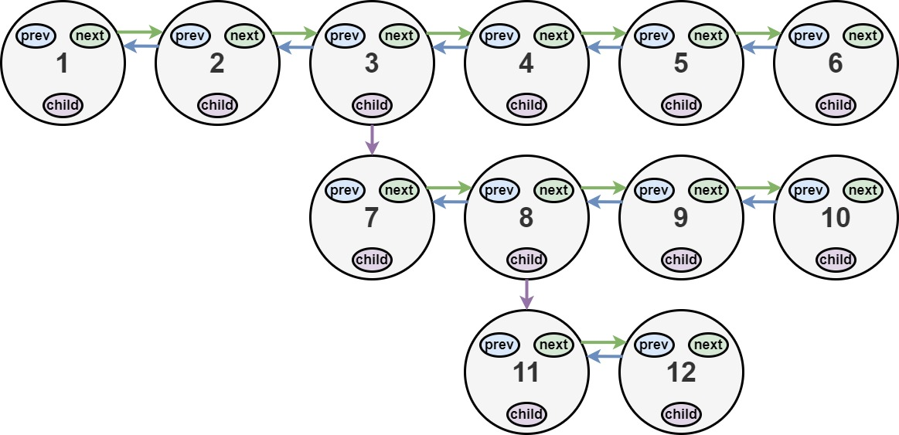

```bash
# 21. Merge Two Sorted Lists [Super Easy]
# 142. Linked List Cycle II - Hash Table, Linked List, Two Pointers [Easy]
# 2. Add Two Numbers - Linked List, Recursion [Easy]
# 876. Middle of the Linked List - Linked List, Two Pointers [Easy]
# 206. Reverse Linked List - Linked List, Recursion [Easy]
# 92. Reverse Linked List II
# 234. Palindrome Linked List
# 138. Copy List with Random Pointer - Hash Table, Linked List
# 430. Flatten a Multilevel Doubly Linked List - Linked List, Depth-First Search, Doubly-Linked List
```

# 21. Merge Two Sorted Lists [Super Easy]
https://leetcode.com/problems/merge-two-sorted-lists/

You are given the heads of two sorted linked lists list1 and list2.

Merge the two lists into one sorted list. The list should be made by splicing together the nodes of the first two lists.

Return the head of the merged linked list.
```
Input: list1 = [1,2,4], list2 = [1,3,4]
Output: [1,1,2,3,4,4]

Input: list1 = [], list2 = []
Output: []

Input: list1 = [], list2 = [0]
Output: [0]
```
```cpp
/**
 * Definition for singly-linked list.
 * struct ListNode {
 *     int val;
 *     ListNode *next;
 *     ListNode() : val(0), next(nullptr) {}
 *     ListNode(int x) : val(x), next(nullptr) {}
 *     ListNode(int x, ListNode *next) : val(x), next(next) {}
 * };
 */
class Solution {
public:
    ListNode* mergeTwoLists(ListNode* list1, ListNode* list2) {
        ListNode * root = nullptr;
        ListNode * current = nullptr;

        if(list1 && list2) {
            if( list1->val <= list2->val) {
                root = list1;
                list1 = list1->next;         
            }
            else {
                root = list2;
                list2 = list2->next;              
            }     
        }
        else {
            root = list1 ? list1 : list2;
            return root;
        }
        
        current = root;
        while(list1 && list2)
        {
            if( list1->val <= list2->val) {
                current->next = list1;
                list1 = list1->next;         
            }
            else {
                current->next = list2;
                list2 = list2->next;              
            }
            
            current = current->next;          
        }
        
        if(list1)
            current->next = list1;
        
        if(list2)
            current->next = list2;
        
        return root;
    }
};
```

# 142. Linked List Cycle II - Hash Table, Linked List, Two Pointers
Given the head of a linked list, return the node where the cycle begins. If there is no cycle, return null.

There is a cycle in a linked list if there is some node in the list that can be reached again by continuously following the next pointer. Internally, pos is used to denote the index of the node that tail's next pointer is connected to (0-indexed). It is -1 if there is no cycle. Note that pos is not passed as a parameter.

Do not modify the linked list.
```py
Example 1:

Input: head = [3,2,0,-4], pos = 1
Output: tail connects to node index 1
Explanation: There is a cycle in the linked list, where tail connects to the second node.
```


```py
Example 2:

Input: head = [1,2], pos = 0
Output: tail connects to node index 0
Explanation: There is a cycle in the linked list, where tail connects to the first node.
```


```py
Example 3:

Input: head = [1], pos = -1
Output: no cycle
Explanation: There is no cycle in the linked list.
 
Constraints:

The number of the nodes in the list is in the range [0, 104].
-105 <= Node.val <= 105
pos is -1 or a valid index in the linked-list.
 

Follow up: Can you solve it using O(1) (i.e. constant) memory?
```

```c++
/**
 * Definition for singly-linked list.
 * struct ListNode {
 *     int val;
 *     ListNode *next;
 *     ListNode(int x) : val(x), next(NULL) {}
 * };
 */
class Solution {
public:
    ListNode *detectCycle(ListNode *head) { 
        if(!head || !head->next)
            return nullptr;
            
        ListNode * slow = head;
        ListNode * fast = head;
        ListNode * match = head;
        
        while(slow->next && fast->next && fast->next->next)
        {
            slow = slow->next;
            fast = fast->next->next;
            
            if(slow == fast)
            {
                while(match != slow)
                {
                    match = match->next;
                    slow = slow->next;
                }

                return match;
            }
        }
        
        return nullptr;
    }
};
```

# 2. Add Two Numbers - Linked List, Recursion

This document describes the solution to the "Add Two Numbers" problem (LeetCode #2).

## Problem Description
You are given two non-empty linked lists representing two non-negative integers. The digits are stored in reverse order, and each of their nodes contains a single digit. Add the two numbers and return the sum as a linked list. You may assume the two numbers do not contain any leading zero, except the number 0 itself.

### Example
```
2 -> 4 -> 3
5 -> 6 -> 4
-----------
7 -> 0 -> 8
-----------
Input: l1 = [2,4,3], l2 = [5,6,4]
Output: [7,0,8]
Explanation: 342 + 465 = 807.

Input: l1 = [0], l2 = [0]
Output: [0]
Explanation: 0 + 0 = 0.

Input: l1 = [9,9,9,9,9,9,9], l2 = [9,9,9,9]
Output: [8,9,9,9,0,0,0,1]
Explanation: 9999999 + 9999 = 10009998.
```

### Constraints
- The number of nodes in each linked list is in the range `[1, 100]`.
- `0 <= Node.val <= 9`
- It is guaranteed that the list represents a number that does not have leading zeros.

## Solution Approach
The problem can be solved by simulating the addition process, handling carry-over digits, and constructing a new linked list for the result.

### Approach
1. Initialize a dummy head node for the result list and a pointer to build the list.
2. Use a `carry` variable to track carry-over from addition.
3. Iterate through both lists while there are digits or a carry:
   - Sum the current digits (if available) and the carry.
   - Create a new node with the units digit (`sum % 10`).
   - Update the carry (`sum / 10`).
   - Move to the next nodes in the input lists (if available).
4. Return the result list starting from the node after the dummy head.

### ListNode Structure
```cpp
struct ListNode {
    int val;
    ListNode *next;
    ListNode() : val(0), next(nullptr) {}
    ListNode(int x) : val(x), next(nullptr) {}
    ListNode(int x, ListNode *next) : val(x), next(next) {}
};
```

### Example Implementation (C++)
```c++
/**
 * Definition for singly-linked list.
 * struct ListNode {
 *     int val;
 *     ListNode *next;
 *     ListNode() : val(0), next(nullptr) {}
 *     ListNode(int x) : val(x), next(nullptr) {}
 *     ListNode(int x, ListNode *next) : val(x), next(next) {}
 * };
 */
class Solution {
public:
    ListNode* addTwoNumbers(ListNode* l1, ListNode* l2) {
        ListNode* dummyHead = new ListNode(0);
        ListNode* curr = dummyHead;
        int carry = 0;
        while (l1 != NULL || l2 != NULL || carry != 0) {
            int x = l1 ? l1->val : 0;
            int y = l2 ? l2->val : 0;
            int sum = carry + x + y;
            carry = sum / 10;
            curr->next = new ListNode(sum % 10);
            curr = curr->next;
            l1 = l1 ? l1->next : nullptr;
            l2 = l2 ? l2->next : nullptr;
        }
        return dummyHead->next;       
    }
};
```

```cpp
class Solution {
public:
    ListNode* addTwoNumbers(ListNode* l1, ListNode* l2) {
        ListNode* dummy = new ListNode(0);
        ListNode* current = dummy;
        int carry = 0;
        
        while (l1 || l2 || carry) {
            int sum = carry;
            if (l1) {
                sum += l1->val;
                l1 = l1->next;
            }
            if (l2) {
                sum += l2->val;
                l2 = l2->next;
            }
            
            current->next = new ListNode(sum % 10);
            current = current->next;
            carry = sum / 10;
        }
        
        return dummy->next;
    }
};
```

### How It Works
- **Dummy Node**: Simplifies list construction by avoiding special handling for the head.
- **Addition Loop**: Processes digits from both lists and the carry:
  - Adds values from `l1`, `l2` (if available), and `carry`.
  - Creates a new node with the units digit.
  - Updates `carry` for the next iteration.
- **Edge Cases**: Handles cases where one list is longer or a carry persists after processing all digits.
- **Result**: The list after `dummy` contains the sum in reverse order.

### Time and Space Complexity
- **Time Complexity**: O(max(N, M)), where `N` and `M` are the lengths of the input lists, as we traverse each list once.
- **Space Complexity**: O(max(N, M)), for the output list containing the result.


# 876. Middle of the Linked List - Linked List, Two Pointers

This document describes the solution to the "Middle of the Linked List" problem (LeetCode #876).

## Problem Description
Given the head of a singly linked list, return the middle node of the linked list. If there are two middle nodes, return the second middle node.

### Example
```
Input: head = [1,2,3,4,5]
Output: [3,4,5]
Explanation: The middle node is node 3 (value 3).

Input: head = [1,2,3,4,5,6]
Output: [4,5,6]
Explanation: There are two middle nodes (3 and 4), so return the second one, node 4 (value 4).

Input: head = [1]
Output: [1]
Explanation: The list has only one node, so it is the middle node.
```

### Constraints
- The number of nodes in the list is in the range `[1, 100]`.
- `1 <= Node.val <= 100`

## Solution Approach
The problem can be solved efficiently using the "Fast and Slow Pointer" technique (also known as the tortoise and hare approach) to find the middle node in a single pass.

### Fast and Slow Pointer Approach
1. Initialize two pointers: `slow` and `fast`, both starting at the head.
2. Move `slow` one step at a time and `fast` two steps at a time.
3. When `fast` reaches the end (or just beyond), `slow` will be at the middle node:
   - For odd-length lists, `slow` points to the exact middle.
   - For even-length lists, `slow` points to the second of the two middle nodes.
4. Return the node pointed to by `slow`.

### ListNode Structure
```cpp
struct ListNode {
    int val;
    ListNode *next;
    ListNode() : val(0), next(nullptr) {}
    ListNode(int x) : val(x), next(nullptr) {}
    ListNode(int x, ListNode *next) : val(x), next(next) {}
};
```

### Example Implementation (C++)
```cpp
class Solution {
public:
    ListNode* middleNode(ListNode* head) {
        ListNode* slow = head;
        ListNode* fast = head;
        
        while (fast && fast->next) {
            slow = slow->next;
            fast = fast->next->next;
        }
        
        return slow;
    }
};
```

### How It Works
- **Initialization**: Both pointers start at the head of the list.
- **Traversal**:
  - `slow` advances one node per iteration.
  - `fast` advances two nodes per iteration.
- **Termination**:
  - When `fast` is null (odd-length list) or `fast->next` is null (even-length list), `slow` is at the middle.
- **Edge Cases**:
  - Single node: `fast->next` is null immediately, so `slow` remains at the head.
  - Even or odd lengths: The approach naturally handles both cases, returning the second middle node for even lengths.
- **Result**: `slow` points to the middle node.

### Time and Space Complexity
- **Time Complexity**: O(n), where `n` is the number of nodes in the list, as we traverse the list once (with `fast` moving twice as fast).
- **Space Complexity**: O(1), as we only use two pointers regardless of list size.

### Alternative Approach
1. **Count and Traverse**:
   - First pass: Count the number of nodes.
   - Second pass: Traverse to the middle node (floor(n/2) for zero-based indexing).
   - Time Complexity: O(n)
   - Space Complexity: O(1)
The Fast and Slow Pointer approach is preferred as it requires only one pass through the list.


# 206. Reverse Linked List - Linked List, Recursion

This document describes the solution to the "Reverse Linked List" problem (LeetCode #206).

## Problem Description
Given the head of a singly linked list, reverse the list, and return the reversed list.

### Example
```
Input: head = [1,2,3,4,5]
Output: [5,4,3,2,1]
Explanation: The list is reversed from 1->2->3->4->5 to 5->4->3->2->1.

Input: head = [1,2]
Output: [2,1]
Explanation: The list is reversed from 1->2 to 2->1.

Input: head = []
Output: []
Explanation: An empty list remains empty.
```

### Constraints
- The number of nodes in the list is in the range `[0, 5000]`.
- `-5000 <= Node.val <= 5000`

## Solution Approach
The problem can be solved iteratively by reversing the direction of each node's `next` pointer.

### Iterative Approach
1. Initialize three pointers:
   - `prev`: Points to the previous node (initially `nullptr`).
   - `curr`: Points to the current node (starts at `head`).
   - `next`: Temporarily stores the next node in the list.
2. Iterate through the list:
   - Save the next node (`next = curr->next`).
   - Reverse the current node's pointer (`curr->next = prev`).
   - Move `prev` and `curr` one step forward (`prev = curr`, `curr = next`).
3. Return `prev`, which points to the new head of the reversed list.

### ListNode Structure
```cpp
struct ListNode {
    int val;
    ListNode *next;
    ListNode() : val(0), next(nullptr) {}
    ListNode(int x) : val(x), next(nullptr) {}
    ListNode(int x, ListNode *next) : val(x), next(next) {}
};
```

### Example Implementation (C++)
```cpp
    ListNode * reverse(ListNode * head)
    {
        ListNode * tail = head; 
        ListNode * prev = tail; //both points to head in the beginning
        
        while(tail && tail->next)
        {
            //1-2-3-4-5
            //current = 1, prev=null, next=null
            head = tail->next; //2 //3 //4 //5
            tail->next = head->next;//1-3-4-5 //2-1-4-5 2-1-5 2-1-null
            head->next = prev; //2-1-3-4-5 //3->2-1-4-5 5-4-3-2-1
            prev = head; //prev = 2 //3 //4 prev=5
        }
        
        return head;
    }
```

```cpp
class Solution {
public:
    ListNode* reverseList(ListNode* head) {
        ListNode* prev = nullptr;
        ListNode* curr = head;
        
        while (curr) {
            ListNode* next = curr->next;
            curr->next = prev;
            prev = curr;
            curr = next;
        }
        
        return prev;
    }
};
```

### How It Works
- **Initialization**: Start with `prev` as `nullptr` and `curr` as `head`.
- **Reversal Process**:
  - Save the next node to avoid losing it.
  - Reverse the `next` pointer of the current node to point to `prev`.
  - Advance `prev` and `curr` to process the next node.
- **Termination**: When `curr` becomes `nullptr`, `prev` points to the new head.
- **Edge Cases**:
  - Empty list: Return `nullptr`.
  - Single node: No change needed, return the head.
- **Result**: The list is reversed in-place.

### Time and Space Complexity
- **Time Complexity**: O(n), where `n` is the number of nodes, as we traverse the list once.
- **Space Complexity**: O(1), as we only use a constant amount of extra space.

### Alternative Approach
1. **Recursive**:
   - Recursively traverse to the end of the list, then reverse pointers while unwinding the recursion.
   - Time Complexity: O(n)
   - Space Complexity: O(n) due to the recursion stack.
The iterative approach is preferred for its constant space complexity and simplicity.


# 92. Reverse Linked List II Solution

## Problem Description
Given the head of a singly linked list and two integers `left` and `right` where `1 <= left <= right <= length of list`, reverse the nodes of the list from position `left` to position `right`, and return the reversed list.

### Example
```
Input: head = [1,2,3,4,5], left = 2, right = 4
Output: [1,4,3,2,5]
```

## Solution
Below is the C++ solution to reverse the linked list from position `left` to `right`.

```cpp
class Solution {
public:
    ListNode* reverseBetween(ListNode* head, int left, int right) {
        ListNode *dummy = new ListNode(0); // created dummy node
        dummy->next = head;
        ListNode *prev = dummy; // intialising prev pointer on dummy node
        
        for(int i = 0; i < left - 1; i++)
            prev = prev->next; // adjusting the prev pointer on it's actual index
        
        ListNode *curr = prev->next; // curr pointer will be just after prev
        // reversing
        for(int i = 0; i < right - left; i++){
            ListNode *forw = curr->next; // forw pointer will be after curr
            curr->next = forw->next;
            forw->next = prev->next;
            prev->next = forw;
        }
        return dummy->next;
    }
};
```

```cpp
/**
 * Definition for singly-linked list.
 * struct ListNode {
 *     int val;
 *     ListNode *next;
 *     ListNode() : val(0), next(nullptr) {}
 *     ListNode(int x) : val(x), next(nullptr) {}
 *     ListNode(int x, ListNode *next) : val(x), next(next) {}
 * };
 */
class Solution {
public:
    ListNode* reverseBetween(ListNode* head, int left, int right) {
        // If no reversal needed
        if (!head || left == right) {
            return head;
        }
        
        // Dummy node to handle cases where reversal starts at head
        ListNode dummy(0);
        dummy.next = head;
        ListNode* pre = &dummy;
        
        // Step 1: Reach the node just before position 'left'
        for (int i = 0; i < left - 1; ++i) {
            pre = pre->next;
        }
        
        // Step 2: Start reversing from 'left' to 'right'
        ListNode* curr = pre->next;
        for (int i = 0; i < right - left; ++i) {
            // Store the next node
            ListNode* next_node = curr->next;
            // Update pointers to reverse the link
            curr->next = next_node->next;
            next_node->next = pre->next;
            pre->next = next_node;
        }
        
        return dummy.next;
    }
};
```

## Explanation
1. **Dummy Node**: Simplifies cases where reversal starts at the head by providing a node before the head.
2. **Traverse to `pre`**: Move to the node just before position `left` using a loop.
3. **Reverse Sublist**: Iteratively reverse links from `left` to `right` by adjusting pointers:
   - Store the next node (`next_node`).
   - Update `curr->next` to skip `next_node`.
   - Link `next_node` to the current head of the reversed sublist (`pre->next`).
   - Update `pre->next` to point to `next_node`.
4. **Reconnect**: Return the modified list starting from `dummy.next`.

## Time and Space Complexity
- **Time Complexity**: O(n), where `n` is the length of the list. We traverse to position `left` and reverse `right - left` nodes.
- **Space Complexity**: O(1), as only a constant amount of extra space is used for pointers.

## Edge Cases
- Single node or `left == right`: No reversal needed.
- Reversal at head: Handled by the dummy node.
- Reversal at tail: Correctly connects to `nullptr`.
- Full list reversal: Works when `left = 1` and `right = length`.


# 234. Palindrome Linked List Solution

## Problem Description
Given the head of a singly linked list, determine if it is a palindrome. A linked list is a palindrome if it reads the same forward and backward.

### Example
```
Input: head = [1,2,2,1]
Output: true

Input: head = [1,2]
Output: false
```

## Solution
Below is the C++ solution to check if a linked list is a palindrome.

```cpp
/**
 * Definition for singly-linked list.
 * struct ListNode {
 *     int val;
 *     ListNode *next;
 *     ListNode() : val(0), next(nullptr) {}
 *     ListNode(int x) : val(x), next(nullptr) {}
 *     ListNode(int x, ListNode *next) : val(x), next(next) {}
 * };
 */
class Solution {
public:
    
typedef ListNode Node;
    Node * reverse(Node * node)
    {
        Node * prev = nullptr;
        while(node)
        {
            Node * next = node->next;
            node->next = prev;
            prev = node;
            node = next;
        }
        
        return prev;
    }
    
    bool isPalindrome(ListNode* head) {
        if(!head || !head->next)
            return true;
        
        Node * slow = head;
        Node * fast = head;
        while(fast && fast->next) {
            slow = slow->next;
            fast = fast->next->next;
        }
        
        //now slow is at middle
        Node * revhead = reverse(slow);
        
        Node * fnode = head;
        Node * snode = revhead;
        
        while(fnode && snode)
        {
            if(fnode->val != snode->val)
                return false;
            
            fnode = fnode->next;
            snode = snode->next;
        }
            
        reverse(revhead);
        return true;
    }
};

class Solution {
public:
    bool isPalindrome(ListNode* head) {
        if (!head || !head->next) {
            return true;
        }
        
        // Step 1: Find the middle of the linked list
        ListNode *slow = head, *fast = head;
        while (fast->next && fast->next->next) {
            slow = slow->next;
            fast = fast->next->next;
        }
        
        // Step 2: Reverse the second half
        ListNode* secondHalf = reverseList(slow->next);
        
        // Step 3: Compare the first half with the reversed second half
        ListNode* firstHalf = head;
        while (secondHalf) {
            if (firstHalf->val != secondHalf->val) {
                return false;
            }
            firstHalf = firstHalf->next;
            secondHalf = secondHalf->next;
        }
        
        return true;
    }
    
private:
    ListNode* reverseList(ListNode* head) {
        ListNode *prev = nullptr, *curr = head, *next = nullptr;
        while (curr) {
            next = curr->next;
            curr->next = prev;
            prev = curr;
            curr = next;
        }
        return prev;
    }
};
```

## Explanation
1. **Edge Cases**:
   - If the list is empty or has one node, it is a palindrome (return `true`).
2. **Find Middle**:
   - Use two pointers: `slow` and `fast`. `fast` moves twice as fast as `slow`.
   - When `fast` reaches the end, `slow` is at the middle (or just before the middle for even-length lists).
3. **Reverse Second Half**:
   - Reverse the list starting from `slow->next` using a helper function `reverseList`.
   - This creates a reversed second half for comparison.
4. **Compare Halves**:
   - Compare the first half (starting from `head`) with the reversed second half.
   - If any values differ, return `false`.
   - If all values match, return `true`.
5. **No Restoration Needed**: The problem does not require restoring the original list.

## Time and Space Complexity
- **Time Complexity**: O(n), where `n` is the number of nodes in the list. Finding the middle takes O(n/2), reversing the second half takes O(n/2), and comparing takes O(n/2).
- **Space Complexity**: O(1), as we only use a constant amount of extra space for pointers (excluding recursive stack if recursion were used).

## Edge Cases
- Empty list: Return `true`.
- Single node: Return `true`.
- Two nodes (e.g., `[1,1]` or `[1,2]`): Correctly identifies palindrome or non-palindrome.
- Odd-length list (e.g., `[1,2,1]`): Compares first and second halves correctly.
- Even-length list (e.g., `[1,2,2,1]`): Handles middle split and comparison.


# 138. Copy List with Random Pointer - Hash Table, Linked List

This document describes the solution to the "Copy List with Random Pointer" problem (LeetCode #138).

## Problem Description
A linked list of length `n` is given such that each node contains an additional random pointer, which could point to any node in the list or null. Construct a deep copy of the list, where the deep copy should consist of exactly `n` new nodes, each with its value set to the value of its corresponding original node. Both the `next` and `random` pointers of the new nodes should point to new nodes in the copied list, preserving the same list structure.

### Example
```
Input: head = [[7,null],[13,0],[11,4],[10,2],[1,0]]
Output: [[7,null],[13,0],[11,4],[10,2],[1,0]]
Explanation: The copied list has the same structure, with new nodes and pointers adjusted to point to the corresponding new nodes.
```


```
Input: head = [[1,1],[2,1]]
Output: [[1,1],[2,1]]
Explanation: The random pointers point to nodes within the copied list.
```


```
Input: head = [[3,null],[3,0],[3,null]]
Output: [[3,null],[3,0],[3,null]]
Explanation: The structure, including null random pointers, is preserved.
```


```
Hint 1
Just iterate the linked list and create copies of the nodes on the go. Since a node can be referenced from multiple nodes due to the random pointers, ensure you are not making multiple copies of the same node.
Hint 2
You may want to use extra space to keep old_node ---> new_node mapping to prevent creating multiple copies of the same node.
Hint 3
We can avoid using extra space for old_node ---> new_node mapping by tweaking the original linked list. Simply interweave the nodes of the old and copied list. For example: Old List: A --> B --> C --> D InterWeaved List: A --> A' --> B --> B' --> C --> C' --> D --> D'
Hint 4
The interweaving is done using next pointers and we can make use of interweaved structure to get the correct reference nodes for random pointers.
```

### Constraints
- `0 <= n <= 1000`
- `-10^4 <= Node.val <= 10^4`
- `Node.random` is null or points to a node in the linked list.

## Solution Approach
The problem can be solved efficiently using an interleaved approach that avoids extra space for mapping, by weaving copied nodes into the original list.

### Interleaved Nodes Approach
1. **Interleave Copied Nodes**:
   - For each node in the original list, create a copy and place it between the original node and its next node (e.g., `1 -> 2` becomes `1 -> 1' -> 2 -> 2'`).
2. **Set Random Pointers**:
   - For each original node, if its `random` pointer points to a node, set the copied node’s `random` pointer to the copy of that node (accessible as `original->random->next`).
3. **Separate Lists**:
   - Extract the copied list by adjusting the `next` pointers to separate the original and copied nodes.
4. Return the head of the copied list.

### Node Structure
```cpp
class Node {
public:
    int val;
    Node* next;
    Node* random;
    Node(int _val) : val(_val), next(nullptr), random(nullptr) {}
};
```

### Example Implementation (C++)
```cpp
/*
// Definition for a Node.
class Node {
public:
    int val;
    Node* next;
    Node* random;
    
    Node(int _val) {
        val = _val;
        next = NULL;
        random = NULL;
    }
};
*/

class Solution {
public:
    Node* copyRandomList(Node* head) {
        if(!head)
            return head;
        
        Node * c = head;
        
        //creat a copy
        while(c)
        {
            Node *cc = new Node(c->val);
            cc->next = c->next;
            c->next = cc;
            c = cc->next;
        }
            
        //1-1`-2-2`-3-3`....
        //set the random pointers next
        c = head;
        while(c)
        {
            Node * rc= (c->random) ? c->random->next : nullptr;
            Node * cc = c->next;
            cc->random = rc;
            c = cc->next;
        }
        
        //splice the copy and original
        c = head;
        Node * chead = head->next;
        
        Node * cc = chead;
        while(cc)
        {
            Node * next = cc->next;
            c->next = next;
            c = c->next;
            if(next)
                cc->next = next->next;
            
            cc = cc->next;
        }
        
        return chead;
    }
};
```

```cpp
class Solution {
public:
    Node* copyRandomList(Node* head) {
        if (!head) return nullptr;
        
        // Step 1: Interleave copied nodes
        Node* curr = head;
        while (curr) {
            Node* copy = new Node(curr->val);
            copy->next = curr->next;
            curr->next = copy;
            curr = copy->next;
        }
        
        // Step 2: Set random pointers for copied nodes
        curr = head;
        while (curr) {
            if (curr->random) {
                curr->next->random = curr->random->next;
            }
            curr = curr->next->next;
        }
        
        // Step 3: Separate the lists
        Node* dummy = new Node(0);
        Node* copyCurr = dummy;
        curr = head;
        while (curr) {
            // Extract copied node
            copyCurr->next = curr->next;
            copyCurr = copyCurr->next;
            
            // Restore original list
            curr->next = copyCurr->next;
            curr = curr->next;
        }
        
        return dummy->next;
    }
};
```

### How It Works
- **Interleaving**:
  - Insert a copy of each node right after the original (e.g., `1 -> 2` becomes `1 -> 1' -> 2 -> 2'`).
- **Random Pointers**:
  - For an original node’s `random` pointer, the copied node’s `random` is the node after the original’s `random` (since copies are interleaved).
- **Separation**:
  - Use a dummy node to build the copied list.
  - Adjust `next` pointers to separate the lists, restoring the original list and linking the copied nodes.
- **Edge Cases**:
  - Empty list: Return `nullptr`.
  - Single node: Copy node with `random` pointing to itself or `nullptr`.
  - Null random pointers: Handled by checking `curr->random`.
- **Result**: Returns the head of the deep-copied list.

### Time and Space Complexity
- **Time Complexity**: O(n), where `n` is the number of nodes, as we traverse the list three times (interleave, set random pointers, separate).
- **Space Complexity**: O(1), excluding the space needed for the output list, as we only use a constant amount of extra space (pointers and dummy node).

### Alternative Approach
1. **Hash Map**:
   - Use a hash map to map original nodes to their copies.
   - First pass: Create all copied nodes.
   - Second pass: Set `next` and `random` pointers using the map.
   - Time Complexity: O(n)
   - Space Complexity: O(n) for the hash map
The interleaved approach is preferred as it achieves O(1) space complexity (excluding output).


# 430. Flatten a Multilevel Doubly Linked List - Linked List, Depth-First Search, Doubly-Linked List

This document describes the solution to the "Flatten a Multilevel Doubly Linked List" problem (LeetCode #430).

## Problem Description
You are given a doubly linked list, which contains nodes that have a next pointer, a previous pointer, and an additional child pointer. This child pointer may point to a separate doubly linked list, forming a multilevel structure. Flatten the list so that all nodes appear in a single-level, doubly linked list. The nodes should appear in the order of a pre-order traversal of the multilevel structure. Return the head of the flattened list.

### Example
```
Input: head = [1,2,3,4,5,6,null,null,null,7,8,9,10,null,null,11,12]
```


```
Output: [1,2,3,7,8,11,12,9,10,4,5,6]
Explanation: The multilevel list with child pointers (e.g., 3->7, 8->11) is flattened into a single list in pre-order.
```


```
Input: head = [1,2,null,3]
Output: [1,3,2]
Explanation: The child list [3] from node 1 is integrated into the main list.
```


```
Input: head = []
Output: []
Explanation: An empty list remains empty.
```


### Constraints
- The number of nodes in the list is in the range `[0, 1000]`.
- `1 <= Node.val <= 10^5`

## Solution Approach
The problem can be solved using a recursive approach that processes each node and its child list, integrating the child list into the main list while maintaining the doubly linked list properties.

### Recursive Flattening Approach
1. Traverse the list starting from the head.
2. For each node:
   - If it has a child, recursively flatten the child list.
   - Integrate the flattened child list between the current node and its next node.
   - Update the `prev` and `next` pointers accordingly.
   - Set the `child` pointer to `null`.
3. Continue processing the next node in the list.
4. Return the head of the flattened list.

### Node Structure
```cpp
class Node {
public:
    int val;
    Node* prev;
    Node* next;
    Node* child;
    Node() : val(0), prev(nullptr), next(nullptr), child(nullptr) {}
    Node(int _val) : val(_val), prev(nullptr), next(nullptr), child(nullptr) {}
    Node(int _val, Node* _prev, Node* _next, Node* _child) :
        val(_val), prev(_prev), next(_next), child(_child) {}
};
```

### Example Implementation (C++)
```cpp
/*
// Definition for a Node.
class Node {
public:
    int val;
    Node* prev;
    Node* next;
    Node* child;
};
*/

class Solution {
public:
    Node* flatten(Node* head) {
        Node * current = head;
        
        while (current) {
            if (current->child) {
                
                // Save the current next and connect the child to next
                Node * tmp_next = current->next;
                current->next = current->child;
                current->next->prev = current;
                current->child = NULL;
                
                // Run till the end of the current list and connect last node to saved next
                Node * runner = current->next; //basically child
                while (runner->next) 
                    runner = runner->next;
                
                runner->next = tmp_next;
                if (runner->next) 
                    runner->next->prev = runner;
            }
            
            current = current->next;
        }
        
        return head;
    }
};
```

```cpp
class Solution {
public:
    Node* flatten(Node* head) {
        flattenHelper(head);
        return head;
    }
    
private:
    Node* flattenHelper(Node* head) {
        Node* curr = head;
        while (curr) {
            if (curr->child) {
                // Flatten the child list
                Node* childTail = flattenHelper(curr->child);
                
                // Connect child list to current node
                Node* nextNode = curr->next;
                curr->next = curr->child;
                curr->child->prev = curr;
                curr->child = nullptr;
                
                // Connect child tail to next node
                childTail->next = nextNode;
                if (nextNode) {
                    nextNode->prev = childTail;
                }
                
                // Move to the next node after child integration
                curr = childTail->next;
            } else {
                curr = curr->next;
            }
        }
        
        // Return the tail of the flattened list starting from head
        curr = head;
        while (curr && curr->next) {
            curr = curr->next;
        }
        return curr ? curr : head;
    }
};
```

### How It Works
- **Traversal**:
  - Process each node in the list.
  - If a node has a child, flatten the child list recursively.
- **Integration**:
  - Connect the flattened child list between the current node and its `next` node.
  - Update `prev` and `next` pointers to maintain doubly linked list properties.
  - Set `child` to `null` after integration.
- **Tail Tracking**:
  - The helper function returns the tail of the flattened list to facilitate connections.
- **Edge Cases**:
  - Empty list: Return `nullptr`.
  - No child pointers: List remains unchanged.
  - Single node with child: Child list is appended after the node.
- **Result**: The list is flattened in pre-order, with all nodes in a single-level doubly linked list.

### Time and Space Complexity
- **Time Complexity**: O(n), where `n` is the total number of nodes in the multilevel list, as each node is processed once.
- **Space Complexity**: O(h), where `h` is the maximum depth of the multilevel structure, due to the recursion stack. In the worst case (deeply nested), this is O(n).

### Alternative Approach
1. **Iterative with Stack**:
   - Use a stack to store nodes and process them in pre-order, adjusting pointers iteratively.
   - Time Complexity: O(n)
   - Space Complexity: O(h) for the stack
The recursive approach is preferred for its clarity and natural handling of the pre-order traversal required for flattening.


